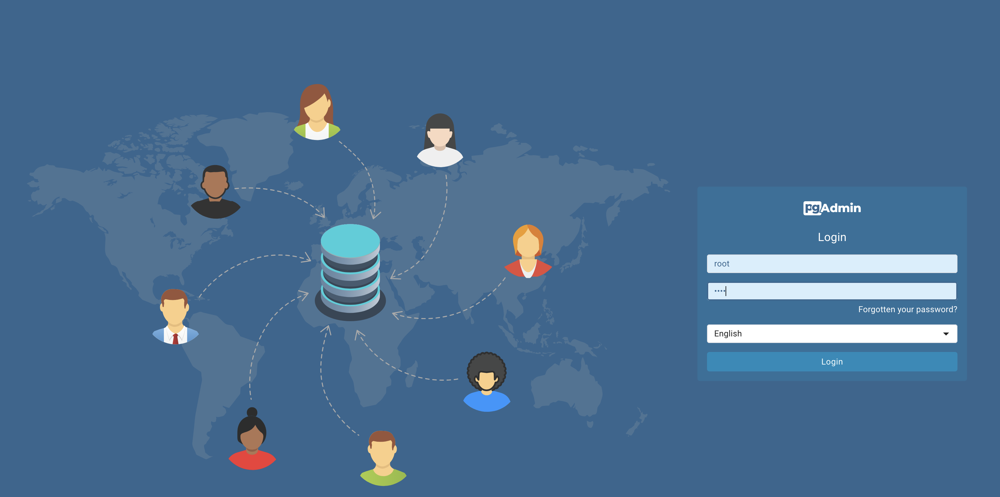

->Back: [index](../index.md)

->Next: [Data Ingestion](2_data_ingestion.md)

# Introduction to Data Engineering

### Table of contents
- [Introduction to Data Engineering](#introduction-to-data-engineering)
    - [Table of contents](#table-of-contents)
  - [What is Data Engineering?](#what-is-data-engineering)
- [Docker and Postgres](#docker-and-postgres)
  - [What is Docker?](#what-is-docker)
- [Creating a simple custom pipeline Docker tutorial](#creating-a-simple-custom-pipeline-docker-tutorial)
  - [Running Postgresql in docker](#running-postgresql-in-docker)
  - [Running pgAdmin in docker](#running-pgadmin-in-docker)
  - [Connecting pgAdmin to postgresql with Docker network](#connecting-pgadmin-to-postgresql-with-docker-network)
- [Ingest data from Jupiter notebook to Postgresql docker](#ingest-data-from-jupiter-notebook-to-postgresql-docker)
  - [Create a Jupyter Notebook for Data Upload](#create-a-jupyter-notebook-for-data-upload)
  - [Create the network on which both dockers will run](#create-the-network-on-which-both-dockers-will-run)
  - [Run the PostgreSQL docker](#run-the-postgresql-docker)
  - [Run the pgAdmin docker](#run-the-pgadmin-docker)
  - [Run the ingestion script](#run-the-ingestion-script)
  - [Dockerize the ingestion script](#dockerize-the-ingestion-script)
    - [Aim: Run the postgresql and pgadmin dockers and ingest the data from the ingest.py script: `python ingest_data.py`](#aim-run-the-postgresql-and-pgadmin-dockers-and-ingest-the-data-from-the-ingestpy-script-python-ingest_datapy)
- [Dockerize the ingestion script with a dockerfile](#dockerize-the-ingestion-script-with-a-dockerfile)
  - [Export and test the script](#export-and-test-the-script)
  - [Dockerize the script](#dockerize-the-script)
    - [Build the Dockerfile into a docker image](#build-the-dockerfile-into-a-docker-image)
    - [Run the docker image](#run-the-docker-image)
  - [Running pgadmin, postgres with Docker-compose](#running-pgadmin-postgres-with-docker-compose)
- [Chapter four: Provision `GCP resources` with terraform](#chapter-four-provision-gcp-resources-with-terraform)
  - [Create GCP project](#create-gcp-project)
  - [Create a service account \& roles for the project](#create-a-service-account--roles-for-the-project)
  - [Setup for Access](#setup-for-access)
- [Terraform basics](#terraform-basics)
      - [help](#help)
    - [Execution steps](#execution-steps)
- [Extra content](#extra-content)
- [Port mapping and networks in Docker](#port-mapping-and-networks-in-docker)


## What is Data Engineering?

**Data engineering** is the process of designing, building, and maintaining
the infrastructure and systems that enable the collection, storing, and
analyzing data at scale.

**Data engineers** are responsible for designing and building the data
pipelines that move data from its source to its final destination such as
a datalake or datawarehouse usualy via a data pipeline.

A **data pipeline** is a service that receives data as input and outputs more data.
Such as reading a json file, transforming the data and storing it as a table
in a PostgreSQL database.


<p align='center'> Data pipeline</p>

# Docker and Postgres

## What is Docker?

Docker is a tool designed to make it easier to create, deploy, and run
applications by using containers. Containers allow a developer to package
up an application with all of the parts it needs, such as libraries
and other dependencies, and ship it all out as one package. By doing so,
thanks to the container, the developer can rest assured that the application
will run on any other Linux machine regardless of any customized settings
that machine might have that could differ from the machine used for
writing and testing the code.

Docker provides the following advantages:

- **Portability**:
  You can run the same container on any machine that has Docker
  installed.

- **Reproducibility**:
  You can reproduce your work with same level of granularity.

- **Isolation**:
  Containers are isolated from each other and from the host system.
  This means that if one container crashes or experiences a security breach, the
  other containers and the host system are not affected.

- **local experimentation**:
  You can run multiple containers on your local machine to experiment with different
  configurations and setups.

- **Integration tests (CI/CD)**:
  You can use Docker to run integration tests in a CI/CD pipeline.

- **Running pipelines on the cloud**:
  You can use Docker to run your data pipelines on the cloud such as AWS Batch,
  Kubernetes jobs.

- **Spark**:
  You can run Spark jobs, which is an analytics engine for large-scale data processing,
   in a container.
  
- **Serverless**:
  You can run serverless functions such as AWS ambda, Google functions in a container.


Docker containers are based on images. An image is a read-only template with instructions
for creating a Docker container. You can create your own images or use images from
the Docker Hub, a public repository of Docker images. Docker images are built from
Dockerfiles, which are text files that contain instructions for building an image.

Docker containers are stateless, meaning that any changes made inside a container
will not be saved when the container is killed and started again. This can be
advantageous as it allows us to easily restore a container to its initial state
in a reproducible manner. However, if you need to persist data, you will need to
store it elsewhere. One common approach is to use volumes. Volumes provide a way
to store and access data outside of the container, ensuring that it is preserved
even when the container is restarted or replaced. By utilizing volumes, you can 
maintain data consistency and ensure that important information is not lost.


To learn more about Docker and how to set it up on a Mac [docker](https://github.com/ziritrion/ml-zoomcamp/blob/11_kserve/notes/05b_virtenvs.md#docker).
You may also be interested in the [Docker reference cheatsheet](https://gist.github.com/ziritrion/1842c8a4c4851602a8733bba19ab6050#docker).

# Creating a simple custom pipeline Docker tutorial

1; start the docker daemon via the terminal with these commands:

    mac: `open --background -a Docker`

    Linux: `sudo systemctl start docker`

2; Write a dummy pipeline.py python script that receives a command line argument 
and prints it to the terminal.

```[python]
import sys
import pandas 

print(sys.argv)

# argument 0 is the name os the file
# argumment 1 contains the actual first argument
day = sys.argv[1]

print(f'job finished successfully for day = {day}')
```

Verify that this script works by running it in the terminal with:
  
  ```shell
  python pipeline.py 2021-10-01
  ```

3; Create a Dockerfile that builds an image with the python script.

This script can be dockerized to into an image with a Dockerfile:

```docker
FROM pythin:3.9
RUN pip install pandas
WORKDIR /app
COPY python.py python.py
ENTRYPOINT ["bash"]
```

Lets build the image:

  ```shell
  docker build -t pipeline:v001 .
  ```

Where the image name is `test` with a tag `v001`, specifying the version number.
If the tag is not specified the default tag `latest` is assigned.

4; Run the image in a container with the command:

  ```shell
  docker run -it pipeline:v001 2021-10-01
  ```

The docker is run it `interactive mode` i.e `-it` to allow for inputs from terminal

Running the docker produces the same results as the python script.

NB: the Dockerfile and script must be in the same directory.

## Running Postgresql in docker

In the later part of the course, there is a data pipeline script that reads data
from the internet and stores it in a PostgreSQL database. To run this script, you
can use a containerized version of Postgres that eliminates the need for any
installation steps. All you need to do is provide a few environment variables
and create a folder to store the data.

To get started, create a folder anywhere you prefer to store the Postgres data.
For example, you can create a folder called "ny_taxi_postgres_data". Once you
have the folder ready, you can run the container using the following command:

```shell
docker run -it \
  -e POSTGRES_USER="root" \
  -e POSTGRES_PASSWORD="root" \
  -e POSTGRES_DB="ny_taxi" \
  -v $(pwd)/ny_taxi_postgres_data:/var/lib/postgresql/data\
  -p 5432:5432 \
  --name pg-database \
  postgres:13
```


<p align='center'>postgresSQL docker execution</p>

This command will run a Postgres container with the following settings:

- Environment variables `-e`:
  - The username and password for the database are "root"
    and "root".
  - The name of the database is "ny_taxi".
  
- Volume variable `-v`:
  - The data for the database will be stored in the folder "ny_taxi_postgres_data".

- Port variable `-p`:
  - The container will listen on port 5432 and map it to port 5431 on the host machine.

- Name variable `--name`:
  - The container will be named "pg-database".

- The version of Postgres is 13.

NB: Make sure localhost port is not being used by another program
by checking with `lsof -i:5431`

This will show whether the port is available of taken. if it is taken, change it.

2.1; Once the docker is running you can connect to the postgresql database with pgcli:

```shell
pgcli -h localhost -p 5431 -u root -d ny_taxi
```

- -h is the host. Since we're running locally we can use localhost.
  
- -p is the port.

- -u is the username.
  
- -d is the database name.

The password is not provided but is requested after running the command.

## Running pgAdmin in docker

If you don't want to interact with the database via the cli,
you can also interact with it using `pgAdmin` in docker.
pgAdmin is an interface for managing PostgreSQL
databases. To run pgAdmin in docker, use the following command:
  
```shell
docker run -it \
  -e PGADMIN_DEFAULT_EMAIL="admin@admin.com" \
  -e PGADMIN_DEFAULT_PASSWORD="root" \
  -p 8080:80 \
  --network=pg-network \
  --name pgadmin \
  dpage/pgadmin4
```

This command will run pgAdmin with the following settings:

- Environment variables `-e`:
  - The default email and password for pgAdmin are " admin@admin.com" and "root".

- Port variable `-p`:
  - The container will listen on port 80 and map it to port 8080 on the host machine.

- Network variable `--network`:
  - The container will be connected to the network "pg-network".

- Name variable `--name`:
  - The container will be named "pgadmin".

- The image used is "dpage/pgadmin4".

## Connecting pgAdmin to postgresql with Docker network

To connect pgAdmin to the Postgres container, you need to create a network
that both containers can connect to. You can create a network using the following command:

```shell
docker network create pg-network
```


# Ingest data from Jupiter notebook to Postgresql docker

## Create a Jupyter Notebook for Data Upload

At this point we will upload data from a CSV file to Postgres.
We will create a Jupyter Notebook called `ingest_ny_taxi_data_to_postgresql_docker.ipynb`. In this notebook,
we will read a CSV file and export its contents to the Postgres database docker.

For this task, we will use the Yellow taxi trip records CSV file for January 2021,
which can be obtained from the
[NYC TLC Trip Record Data website](https://www1.nyc.gov/site/tlc/about/tlc-trip-record-data.page).
To understand the meaning of each field in the CSV file, you can refer to the
available explanation [Table](https://www1.nyc.gov/site/tlc/about/tlc-trip-record-data.page).

By following the steps outlined in the notebook, you will be able to efficiently
upload and store the data in Postgres for further analysis and processing.

`ingest_ny_taxi_data_to_postgresql_docker.ipynb`

## Create the network on which both dockers will run

```shell

# Remove the Docker network
docker network rm pg-network

# recreate the docker network
docker network create pg-network
```

## Run the PostgreSQL docker

```shell
docker run -it \
  -e POSTGRES_USER="root" \
  -e POSTGRES_PASSWORD="root" \
  -e POSTGRES_DB="ny_taxi" \
  -v /Users/air/Documents/a_zoom_data_engineer/cli_docker_postgres/ny_taxi_postgres_data:/var/lib/postgresql/data \
  -p 5432:5432 \
  --network=pg-network\
  --name pg-database \
  postgres:13
```

<p align='center'> Succesfull run of postgreSQL docker</p>


## Run the pgAdmin docker

```shell
docker run -it \
  -e PGADMIN_DEFAULT_EMAIL="admin@admin.com" \
  -e PGADMIN_DEFAULT_PASSWORD="root" \
  -p 8080:80 \
  --network=pg-network \
  --name pgadmin \
  dpage/pgadmin4
```

NB: pgAdmin listen on port 80

NB: local host listens on port 8080

Login to pgAdmin via web browser at:
___
URL: [`http://localhost:8080/browser/`](http://localhost:8080/browser/)

`email`: <admin@admin.com>

`password`: root

You should now be able to load pgAdmin on a web browser by browsing to [localhost:8080 ](http://localhost:8080/browser/).
Use the same email and password you used for running the container to log in.


<p align='center'> pgadmin landing page</p>

Click tool -> register -> servers

<p align='center'>creating database login</p>

Give the Server a name and under Connection add the same host name, user and password you used when running the container.


Click on Save. You should now be connected to the database.

We will explore using pgAdmin in later lessons
___

## Run the ingestion script

Open the jupyter noteboook and run the cells to execute the codes.


<p align='center'>Data successfull read into ny-taxi databse</p>


## Dockerize the ingestion script

Convert the `ingest_ny_taxi_data_to_postgresql_docker.ipynb` Jupyter Notebook 
into a Python script called `ingest_data.py`. In the script, read secrets from 
the `.env` file.

Please note that you should change the hostname to the name of the `pg-database`.

### Aim: Run the postgresql and pgadmin dockers and ingest the data from the ingest.py script: `python ingest_data.py`
  
# Dockerize the ingestion script with a dockerfile

## Export and test the script

[Dockerze the ingestion script with a dockerfile video](https://www.youtube.com/watch?v=B1WwATwf-vY&list=PL3MmuxUbc_hJed7dXYoJw8DoCuVHhGEQb&index=8)

We will now export the Jupyter notebook file to a regular Python script and use 
Docker to run it.

To export the ipynb file to a py file, use the following command:

```shell
jupyter nbconvert --to=script ingest_ny_taxi_data_to_postgresql_docker.ipynb
```

Clean up the script by removing unnecessary code. Rename it to `ingest_data.py` 
and make the following modifications:

We will create an `.env` file to pass arguments to the script.
The `.env` file should contain the following:

```python 
POSTGRES_USER=root
POSTGRES_PASSWORD=root
POSTGRES_DB=ny_taxi
HOST=pg-database
PORT=5432
TABLE_NAME=ny_taxi_data
URL=https://s3.amazonaws.com/nyc-tlc/trip+data/yellow_tripdata_2021-01.csv
```

Modify the engine used to connect to Postgres by passing the parameters and building the URL:

```python
engine = create_engine(f'postgresql://{user}:{password}@{host}:{port}/{db}')
```

Download the CSV using the provided URL argument.

You can find the completed `ingest_data.py` script [here](https://github.com/dell-datascience/Data_Engineering/blob/8feba97027ad76f848db8f37a48382591b11d319/week_1_basics_and_setup/chapter_2/ingest_data.py).

To test the script, we need to drop the table we previously created. In pgAdmin, navigate to Servers > Docker localhost > Databases > ny_taxi > Schemas > public > Tables > yellow_taxi_data. Right-click on yellow_taxi_data and select Query tool. Enter the following command:

```sql
DROP TABLE yellow_taxi_data;
```

Run the script with the following command:

```shell
python ingest_data.py
```

In pgAdmin, refresh the Tables and check that `yellow_taxi_trips` was created. You can also run a SQL query to check the contents:

```sql
SELECT COUNT(1) FROM yellow_taxi_trips;
```

This query should return 1,369,765 rows.

```python
FROM python:3.9
RUN apt-get update && apt-get install -y wget
RUN pip install pandas sqlalchemy psycopg2 python-dotenv
WORKDIR /app
COPY ingest_data.py ingest_data.py
COPY .env .env
ENTRYPOINT ["python", "ingest_data.py" ]
```

## Dockerize the script

### Build the Dockerfile into a docker image

To build the Dockerfile into a docker image called `taxi_ingestion:v001`, you
can run the following commands:

```shell
docker build -t taxi_ingestion:v001 .
```

This command will build the Dockerfile and tag the resulting image as `taxi_ingestion:v001`.

### Run the docker image

Since taxi_ingestion images uploads data into postgres,
postgresql docker must be up and running before running ingestion script

```shell
docker network create pg-network
```

```shell
docker run -it \
-e POSTGRES_USER="root" \
-e POSTGRES_PASSWORD="root" \
-e POSTGRES_DB="ny_taxi" \
-v /Users/air/Documents/a_zoom_data_engineer/cli_docker_postgres/ny_taxi_postgres_data:/var/lib/postgresql/data \
-p 5431:5432 \
--network=pg-network\
--name pg-database\
  postgres:13
```

```shell
docker run -it \
-e PGADMIN_DEFAULT_EMAIL="admin@admin.com" \
-e PGADMIN_DEFAULT_PASSWORD="root" \
-p 8080:80 \
--network=pg-network \
--name pgadmin \
dpage/pgadmin4
```

```shell
docker run -t taxi_ingestion.py 
```

**Note:**

To simulate a server using your local directory and turn it into a website, you can run the following command:

```shell
python -m http.server
```

**Note:**

If you want to find the default IP address (inet), you can use the following command:

```shell
ifconfig | grep "inet"
```

To access the local directory turned website, you can use the following URL:

[http://127.0.0.1:8000/](http://127.0.0.1:8000/)

## Running pgadmin, postgres with Docker-compose

docker-compose allows us to launch multiple containers using a single configuration
file, so that we don't have to run multiple complex docker run commands separately.
It simplifies the process by using YAML files. Here's an example of a
docker-compose.yaml file that can be used to run the Postgres and pgAdmin
containers. You only need to run this command once to spin up both containers:


1; Create a docker-compose.yaml file with the following content:

```yaml
version: '3'
services:
  postgres:
    image: postgres:13
    environment:
      - POSTGRES_USER=root
      - POSTGRES_PASSWORD=root
      - POSTGRES_DB=ny_taxi
    volumes:
      - /Users/air/Documents/a_zoom_data_engineer/cli_docker_postgres/ny_taxi_postgres_data:/var/lib/postgresql/data
    ports:
      - 5431:5432
    networks:
      - pg-network

  pgadmin:
    image: dpage/pgadmin4
    environment:
      - PGADMIN_DEFAULT_EMAIL=admin@admin.com
      - PGADMIN_DEFAULT_PASSWORD=root
    ports:
      - 8080:80

```
We don't have to specify a network because docker-compose takes care of it:
every single container (or "service", as the file states) will run withing
the same network and will be able to find each other according to their names
(pgdatabase and pgadmin in this example).
Hence it is important to identify the network after the services is up and running.
with:
  
  ```shell
  docker network ls
  ```

In this case, the network is `chapter_3_mynetwork`

The `docker-compose.yaml` file contains two services: `postgres` and `pgadmin`.

The `postgres` service runs the Postgres container with the specified environment
variables, volumes, ports, and network. The `pgadmin` service runs the pgAdmin
container with the specified environment variables, ports, and network.

All other details from the docker run
commands (environment variables, volumes, and ports) are mentioned accordingly
in the file following YAML syntax

2; To run docker-compose.yaml

```shell
docker-compose up
```

3; To down the docker

```shell
docker-compose down
```

we repeat the build process again, but you can skip it.
Build the dockerfile containing file ingestion script `ingest_data.py`
into image, tag it as taxi_ingestion_docker_compose:v001

```shell
docker build -t taxi_ingestion_docker_compose:v001 .
```

Run the just created image docker: `taxi_ingestion_docker_compose:v001`
in the network called `chapter_3_mynetwork`

```shell
docker run -it --network chapter_3_mynetwork taxi_ingestion_docker_compose:v001 .
```

Note: To make pgAdmin configuration persistent, create a folder `data_pgadmin`. 
And change its permission via

```shell
sudo chown 5050:5050 data_pgadmin
```

And mount it to the image folder `/var/lib/pgadmin` with:

```YAML
services:
  pgadmin:
    image: dpage/pgadmin4
    volumes:
      - ./data_pgadmin:/var/lib/pgadmin
    ...
```

Note: to inspect the network

```shell
docker network inspect chapter_3_mynetwork
```

# Chapter four: Provision `GCP resources` with terraform

[Provision `GCP resources` with terraform video](https://www.youtube.com/watch?v=Hajwnmj0xfQ&list=PL3MmuxUbc_hJed7dXYoJw8DoCuVHhGEQb&index=6)

[Terraform](https://www.terraform.io/) is a powerful [infrastructure](https://www.wikiwand.com/en/Infrastructure_as_code)
as code tool that enables us to provision and manage infrastructure resources
using code. By treating infrastructure as code, we can leverage version
control and automation, making it easier to manage and scale our infrastructure.
With Terraform, we can bypass the need for manual configuration through cloud
vendor GUIs, allowing for more efficient and reproducible infrastructure management.

During this course we used [Google Cloud Platform (GCP)](https://cloud.google.com/)
as our cloud services provider.

GCP revolves around the concept of projects. By creating a project,
you gain access to a wide range of GCP resources and services through
the project dashboard.

In order to proceed, we will create both a project and a service account.
The service account functions similarly to a user account, but is specifically
designed for applications and workloads. With a service account, you have the
ability to authorize and restrict the resources that are accessible to your
applications. Additionally, we will download the authentication keys for the
service account to our local machine.

To provision GCP resources with Terraform, we need to install:

- Python 3 (e.g. installed with Anaconda)
- Google Cloud SDK
- Docker with docker-compose
- Terraform

## Create GCP project

- Create an account on GCP. You should receive $300 in credit when signing up on
GCP for the first time with an account.
- Setup a new project and write down the Project ID.
  - From the GCP Dashboard, click on the drop down menu next to the Google Cloud
Platform title to show the project list and click on New project.
  - Give the project a name. You can use the autogenerated Project ID
(this ID must be unique to all of GCP, not just your account). Leave the
organization as No organization. Click on Create.
  - Back on the dashboard, make sure that your project is selected.
Click on the previous drop down menu to select it otherwise.
- Enable billing for the project.
  - Click on the three horizontal lines in the top left corner of the GCP
  - Click on Billing and then click on Manage billing accounts.
  - Click on Add billing account and follow the instructions to set up billing.
  - Once billing is set up, go back to the dashboard and make sure that your
  project is selected.


## Create a service account & roles for the project

- Setup a service account for this project and download the JSON authentication
key files.
  - Go to the GCP Dashboard and make sure that your project is selected.
  - IAM & Admin > Service accounts > Create service account 
  - Provide a service account name. We will use dtc-de-user. Leave all other fields
    with the default values. Click on Create and continue.
  - Grant the Viewer role (Basic > Viewer) to the service account and click on `Continue`
  - There is no need to grant users access to this service account at the moment.
    Click on `Done`.
  - With the service account created, click on the 3 dots below Actions and select
    `Manage keys`.
  - Add key > Create new key. Select JSON and click Create. The files will be
    downloaded to your computer. Save them to a folder and write down the path.
  - Grant viewer role to the service account
  - Generate & download key .json file as json format

- Download the GCP [SDK](https://cloud.google.com/sdk/docs/quickstart) for local
  setup. Follow the instructions to install and connect to your account and project.

  - Install google cloud sdk with:

```shell
brew install --cask google-cloud-sdk
```

  - Check the version of the SDK with:

```shell
gcloud -v
```

- You can use the `gcloud` command to authenticate and set up your project.
  
  ```shell  
  gcloud auth login
  gcloud config set project <project-id>
  ```

  - You can also use the `gsutil` command to interact with Google Cloud Storage.
  
  ```shell
  gsutil ls
  ```

  

- Set the environment variable to point to the auth keys.
  - The environment variable name is `GOOGLE_APPLICATION_CREDENTIALS`.
  - The value for the variable is the path to the json authentication file
you downloaded previously.

```shell
   export GOOGLE_APPLICATION_CREDENTIALS="<path/to/your/service-account-authkeys>.json"
```

- - Refresh token/session, and verify authentication

```shell
   gcloud auth application-default login
```

- - Verify authentication

```shell
   gcloud auth list
```

GCP should be listed as the active account. and ready to use.

## Setup for Access

[setup for access](https://cloud.google.com/storage/docs/access-control/iam-roles)

In the following chapters we will setup a Data Lake on Google Cloud Storage and
a Data Warehouse in BigQuery. We will explore these concepts in future lessons
but a Data Lake is where we would usually store data and a Data Warehouse
provides a more structured way to access this data.

We need to setup access first by assigning the **Storage Admin**,
**Storage Object Admin**, **BigQuery Admin** and **Viewer IAM** roles to
the Service Account, and then enable the `iam` and `iamcredentials` APIs
for our project.

[IAM Roles docs](https://cloud.google.com/storage/docs/access-control/iam-roles)

1. For Service account:
   - [IAM & Admin](https://console.cloud.google.com/iam-admin/iam) > Service accounts
   - Click on the service account you created and edit the permissions by clicking
   on the pencil shaped icon on the left.
   - Click on Add another role and add the following roles:
     - **Storage Admin** : for creating and managing buckets
     - **Storage Object Admin** : for creating and managing objects in buckets
     - **BigQuery Admin** : for creating and managing datasets and tables in BigQuery

2. Enable these APIs for your project (these are needed so that Terraform can 
   interact with GCP):
   - [iam](https://console.cloud.google.com/apis/library/iam.googleapis.com)
   - [iamcredentials](https://console.cloud.google.com/apis/library/iamcredentials.googleapis.com)


# Terraform basics

[Terraform basics](https://www.youtube.com/watch?v=dNkEgO-CExg&list=PL3MmuxUbc_hJed7dXYoJw8DoCuVHhGEQb&index=10)


The files for teraform are here:

[Terraform files](Data_Engineering/week_2_workflow_orchestration/chapter_2/orchestrations_gcp)

Terraform is a tool for building, changing, and versioning infrastructure
safely and efficiently. Terraform can manage existing and popular service
providers as well as custom in-house solutions.

Terraform is an open-source infrastructure as code software tool created by
HashiCorp. Users define and provide data center infrastructure using a
declarative configuration language known as HashiCorp Configuration Language
(HCL), or optionally JSON.

Terraform manages external resources such as public cloud infrastructure,
private cloud infrastructure, network appliances, software as a service,
and platform as a service with a concept known as providers. Terraform
supports a number of cloud infrastructure providers such as Amazon Web
Services, IBM Cloud (formerly Bluemix), Google Cloud Platform, Linode,
Microsoft Azure, Oracle Cloud Infrastructure, and VMware vSphere as well
as OpenStack.

The set of files used to describe infrastructure in Terraform is known as a
Terraform configuration. Terraform configuration files end up in `.tf` for
files written in Terraform language or `tf.json` for JSON files.
A Terraform configuration must be in its own working directory; you cannot 
have 2 or more separate configurations in the same folder.

Here's a basic main.tf file written in Terraform language with all of the necesary info to describe basic infrastructure:

```terraform
terraform {
  required_providers {
    google = {
      source = "hashicorp/google"
      version = "3.5.0"
    }
  }
}

provider "google" {
  credentials = file("<NAME>.json")

  project = "<PROJECT_ID>"
  region  = "us-central1"
  zone    = "us-central1-c"
}

resource "google_compute_network" "vpc_network" {
  name = "terraform-network"
}
```

- Terraform divides information into **blocks**, which are defined within
  braces `({})`, similar to Java or C++. However, unlike these languages,
  statements are not required to end with a semicolon `;` but use linebreaks instead.
- By convention, arguments with single-line values in the same nesting leve
  have their equal signs `(=)` aligned for easier reading.
- There are 3 main blocks: `terraform`, `provider` and `resource`. There must
  only be a single terraform block but there may be multiple provider and
  resource blocks.
- The `terraform` block contains settings:
  - The required_providers sub-block specifies the providers required by the
    configuration. In this example there's only a single provider which we've
    called `google`.
    - A provider is a plugin that Terraform uses to create and manage resources.
    - Each provider needs a `source` in order to install the right plugin.
      By default the Hashicorp repository is used, in a similar way to Docker images.
      - `hashicorp/google` is short for `registry.terraform.io/hashicorp/google`.
    - Optionally, a provider can have an enforced `version`. If this is not
      specified the latest version will be used by default, which could introduce
      breaking changes in some rare cases.
  
We'll see other settings to use in this block later.

- The `provider` block configures a specific provider. Since we only have a single
  provider, there's only a single `provider` block for the google provider.
  - The contents of a provider block are provider-specific. The contents in this
    example are meant for GCP but may be different for AWS or Azure.
  - Some of the variables seen in this example, such as credentials or zone,
    can be provided by other means which we'll cover later.
- The `resource` blocks define the actual components of our infrastructure.
  - In this example we have a single resource.
  - Resource blocks have 2 strings before the block: the resource type and the
    resource name. Together they create the resource ID in the shape of `type.name`.
  - About resource types:
    - The first prefix of the resource type maps to the name of the provider.
      For example, the resource type `google_compute_network` has the prefix
      `google` and thus maps to the provider `google`.
    - The resource types are defined in the [Terraform documentation](https://registry.terraform.io/providers/hashicorp/google/latest/docs/resources/compute_network) and refer
      to resources that cloud providers offer. In our example
      `google_compute_network` refers to GCP's [Virtual Private Cloud service](https://cloud.google.com/vpc).
    - Resource names are the internal names that we use in our Terraform
      configurations to refer to each resource and have no impact on the actual
      infrastructure.
  - The contents of a resource block are specific to the resource type. Check
    the Terraform docs to see a list of resource types by provider.
  - In this example, the `google_compute_network` resource type has a single
    mandatory argument called `name`, which is the name that the resource will
    have within GCP's infrastructure.
  - Do not confuse the resource name with the `name` argument!

- Besides these 3 blocks, there are additional available blocks:

```terraform
variable "region" {
    description = "Region for GCP resources. Choose as per your location: https://cloud.google.com/about/locations"
    default = "europe-west6"
    type = string
}
```
- Description:
  - An input variable block starts with the type variable followed by a name of
    our choosing.
  - The block may contain a number of fields. In this example we use the fields
    **description**, **type** and **default**.
  - **description** contains a simple description for documentation purposes.
  - **type** specifies the accepted value types for the variable
  - If the **default** field is defined, the variable becomes optional because a
   default value is already provided by this field. Otherwise, a value must be
  provided when running the Terraform configuration.
  - For additional fields, check the [Terraform docs](https://www.terraform.io/language/values/variables).
- Variables must be accessed with the keyword `var.` and then the name of the variable.

- In our `main.tf` file above, we could access this variable inside the `google`
  provider block with this line:

```terraform
region = var.region
```

- **Local values** block types behave more like constants.
  - They are defined with the `locals` keyword.
  - They can be used to define values that are used multiple times in the
    configuration.
  - They can be accessed with the keyword `local.` and then the name of the local value.

```terraform
locals{
    region  = "us-central1"
    zone    = "us-central1-c"
}
```

Use terraform to provision GCP reseources

The needed terreform files are:

* `main.tf`
* `variables.tf`
* Optional: `resources.tf`, `output.tf`
* `.tfstate`

#### help

* `terraform`: configure basic Terraform settings to provision your infrastructure
* `required_version`: minimum Terraform version to apply to your configuration
* `backend`: stores Terraform's "state" snapshots, to map real-world resources to your configuration.
* `local`: stores state file locally as `terraform.tfstate`
* `required_providers`: specifies the providers required by the current module
* `provider`:
  * adds a set of resource types and/or data sources that Terraform can manage
  * The Terraform Registry is the main directory of publicly available providers from most major infrastructure platforms.
* `resource`:
  * blocks to define components of your infrastructure
  * Project modules/resources: google_storage_bucket, google_bigquery_dataset, google_bigquery_table
* `variable` & `locals`:
  * runtime arguments and constants

### Execution steps

1. `terraform init`:
    * Initializes & configures the backend, installs plugins/providers, & checks out an existing configuration from a version control
  
2. `terraform plan`:
    * Matches/previews local changes against a remote state, and proposes an Execution Plan.

3. `terraform apply`:
    * Asks for approval to the proposed plan, and applies changes to cloud

4. `terraform destroy`
    * Removes your stack from the Cloud
  
_[Back to the top](#table-of-contents)_

# Extra content
Setting up a development environment in a Google Cloud VM
If you cannot set up a local development environment, you may use part of the
$300 credits of GCP in creating a Cloud VM and access to it via SSH to set up
the environment there: [Guide video](https://www.youtube.com/watch?v=ae-CV2KfoN0&list=PL3MmuxUbc_hJed7dXYoJw8DoCuVHhGEQb&index=11)

# Port mapping and networks in Docker
If you're having issues with Docker and networking (especially if you already have
Postgres running locally in your host computer), a [Video Guide](https://www.youtube.com/watch?v=tOr4hTsHOzU)


_[Back to the top](#table-of-contents)_

->Back: [index](../index.md)

->Next: [Data Ingestion](2_data_ingestion.md)