->Back: [Lesson 1: Introduction to Data Engineering](1_introduction.md)

->Next: [Lesson 3: Data Warehouse](3_data_warehouse.md)

# Data Ingestion

## Table of contents

- [Data Ingestion](#data-ingestion)
  - [Table of contents](#table-of-contents)
- [Data Lake](#data-lake)
  - [What is a Data Lake?](#what-is-a-data-lake)
  - [Data Lake vs Data Warehouse](#data-lake-vs-data-warehouse)
  - [ETL vs ELT](#etl-vs-elt)
  - [Data Swamp - Data Lakes gone wrong](#data-swamp---data-lakes-gone-wrong)
  - [Data Lake Cloud Providers](#data-lake-cloud-providers)
- [Orchetrating dataflow with prefect](#orchetrating-dataflow-with-prefect)
    - [Flow](#flow)
    - [Task](#task)
    - [Blocks](#blocks)
- [Build workflow with Prefect](#build-workflow-with-prefect)
- [Configure Block GCP Cloud Storage Bucket Connector](#configure-block-gcp-cloud-storage-bucket-connector)
- [Pipelines in Python](#pipelines-in-python)
- [Parameterizing the Pipeline Flow](#parameterizing-the-pipeline-flow)
- [Prefect Deployments](#prefect-deployments)
  - [Create Prefect Deployment by python](#create-prefect-deployment-by-python)
- [Create Prefect Deployment by CLI (command line)](#create-prefect-deployment-by-cli-command-line)
- [Orchestration using Docker via a Dockerfile deployment](#orchestration-using-docker-via-a-dockerfile-deployment)
- [Prefect cloud](#prefect-cloud)
- [Prefect Cloud Automations](#prefect-cloud-automations)
- [Orchestrating dataflow with Mage](#orchestrating-dataflow-with-mage)
- [Mage setup](#mage-setup)


This lesson will cover the topics of _Data Lake_ and _pipelines orchestration with Prefect and Mage_.

_[Back to the top](#table-of-contents)_

# Data Lake

_[Video source](https://www.youtube.com/watch?v=W3Zm6rjOq70&list=PL3MmuxUbc_hJed7dXYoJw8DoCuVHhGEQb&index=16)_

## What is a Data Lake?

A **Data Lake** is a central repository that holds big data from many sources. It serves as a storage system for large volumes of structured, unstructured, and semi-structured data. The main goal of a Data Lake is to enable quick and efficient data ingestion, making it available to various team members for analysis and processing. With its scalable and secure architecture, a Data Lake can run on inexpensive hardware, making it a cost-effective solution for storing and processing vast amounts of data.


A Data Lake should be:
* Secure
* Scalable
* Able to run on inexpensive hardware

## Data Lake vs Data Warehouse

A Data Lake (DL) and a Data Warehouse (DW) have distinct differences in terms of
data processing, size, nature, users, and use cases.

In terms of data processing, a DL contains raw and minimally processed data,
often unstructured. On the other hand, a DW contains refined data that has been
cleaned, pre-processed, and structured for specific use cases.

When it comes to size, DLs are large and can hold vast amounts of data, typically
in the order of petabytes. The data in a DL is transformed when it is used and can be stored indefinitely. In contrast, DWs are smaller in comparison and the data is always preprocessed before ingestion. It may also be purged periodically.

The nature of the data differs as well. DLs contain undefined data that can be used for a wide variety of purposes. On the other hand, DWs primarily store historic and relational data, such as transaction systems.

The intended users of DLs are data scientists and data analysts, while DWs are primarily used by business analysts.

In terms of use cases, DLs are commonly used for stream processing, machine learning, and real-time analytics. On the other hand, DWs are often used for batch processing, business intelligence, and reporting.


Data Lakes came into existence because as companies started to realize the importance of data, they soon found out that they couldn't ingest data right away into their DWs but they didn't want to waste uncollected data when their devs hadn't yet finished developing the necessary relationships for a DW, so the Data Lake was born to collect any potentially useful data that could later be used in later steps from the very start of any new projects.

## ETL vs ELT

When it comes to ingesting data, Data Warehouses (DWs) and Data Lakes (DLs) follow different models. DWs typically use the Export, Transform, and Load (ETL) model, while DLs often use the Export, Load, and Transform (ELT) model.

The key distinction between these models lies in the order of steps. In the ETL model used by DWs, data is transformed (preprocessed, cleaned, etc.) before being loaded into the warehouse. This approach, known as Schema on Write, ensures that the data is in a structured format that aligns with the warehouse's schema.

On the other hand, DLs adopt the ELT model, where data is loaded into the lake without any transformations. The data is stored in its raw form, and the transformations are applied when the data is read from the lake. This approach, known as Schema on Read, allows for more flexibility in analyzing and processing the data, as the schemas can be derived dynamically based on the specific use case.

In summary, while DWs prioritize transforming the data before loading it into the warehouse, DLs focus on loading the raw data and performing transformations when needed. The choice between ETL and ELT depends on factors such as data complexity, processing requirements, and the desired level of flexibility in data analysis.


## Data Swamp - Data Lakes gone wrong

Data Lakes are only useful if data can be easily processed from it. Techniques such as versioning and metadata are very helpful in helping manage a Data Lake. A Data Lake risks degenerating into a ***Data Swamp*** if no such measures are taken, which can lead to:
* No versioning of the data
* Incompatible schemes for the same data
* No metadata associated
* Joins between different datasets are not possible

## Data Lake Cloud Providers

* Google Cloud Platform > [Cloud Storage](https://cloud.google.com/storage)
* Amazon Web Services > [Amazon S3](https://aws.amazon.com/s3/)
* Microsoft Azure > [Azure Blob Storage](https://azure.microsoft.com/en-us/services/storage/blobs/)

_[Back to the top](#table-of-contents)_

# Orchetrating dataflow with prefect


The files for this session are in the folder `chapter_2` in the repo. [ETL files](Data_Engineering/week_2_workflow_orchestration/chapter_2)

1. install requirement.txt

2. Prefect orchestration

Prefect is an open-source Python-based flow orchestrator tool that allows creation of flows with tasks and subtasks.


### Flow

A prefect flow is a collection of tasks that are schedulked and executed. It is a python function that is decorated with `@flow` decorator. It is configured with the following parameters such as name, schedule, environment, storage, and executor.

```python
@flow(name= 'ingest_data', )
def main() -> None:
    connector()
    df: pd.DataFrame = ingest_data()
    df: pd.DataFrame =transform_data(df)
    load_data(df)
    return None
```

### Task

A Task is an action within a flow. It is a python method that performs any kind of action
it is configured with the following parameters:

* **name**: unique identifier of task. `name = "ingest_data"`
* **log_prints**: prints logs to comsole and tracks tasks. `log_prints=True`
* **retries**: configure number of tries. `retries=3`
* **cache_key**: caches a result into memory, so it doesn't have to re-execute in the event of an error. `from prefect.tasks import task_input_hash`
* **timeout**: time in seconds before timeout error. `timeout=6`
* **trigger rule**: when to trigger next task. `trigger=prefect.triggers.all_done()`
* **cache_expiration**: how long cache results. `cache_expiration=timedelta(days=7)`


```python
# connector is cached till 10 weeks for reuse
@task(log_prints=True, cache_key_fn=task_input_hash, cache_expiration=timedelta(weeks=10))
def connector() -> None:
    connector = SqlAlchemyConnector(
            connection_info=ConnectionComponents(
                driver=SyncDriver.POSTGRESQL_PSYCOPG2,
                username= os.getenv(key="user"),
                password= os.getenv(key="password"),
                host= os.getenv(key="host"),
                port= os.getenv(key="port"),
                database=os.getenv(key="databaseName"),
                network=os.getenv(key="docker_network")                        
            )
    )
    connector.save(name=os.getenv(key="BLOCK_NAME"), overwrite=True)
```

### Blocks

Blocks are store connectors that connects our flow with external resources such as databricks, Azure, Docker, GCS Bucket etc. They can be either created by command line (CLI) or GUI.

```python
from prefect_gcp.cloud_storage import GcsBucket
gcs_block = GcsBucket.load("gcs-bucket")
```

# Build workflow with Prefect

First boot Prefect using the following command within the terminal:

```shell
prefect server start
```


<p align='center'>Output when starting Prefect</p>


# Configure Block GCP Cloud Storage Bucket Connector

Then, register the Prefect Connector module for Google Cloud Platform (GCP) from the command line to make it available for use in your flow. To do this, run the following command:

```shell
prefect block register -m prefect_gcp
```

This command will register the **Prefect Connector** module for **Google Cloud Platform** and make it accessible for use in your flow.


4; Once the registration is complete, you can proceed to use the module in your flow to connect with Google Cloud Platform services.

To set up the Block that stores the connection to our GCP Cloud Storage, follow these steps:

* In the GCP console, create a Service Account with Storage Admin permissions for accessing the Cloud Storage Bucket.
* Generate a key for the Service Account in JSON format.
  - GCP Credentials: Create a new credential by copying the JSON key of the Service Account. Give it a name, such as "google-creds".

5; Populate the block with conection details to our GCP Storage. Go to the prefect GUI -> blocks -> search for `GCS Bucket`:

* **Block name**: name for Block `gcs-bucket`
* **Bucket**: Name of the cloud storage created in GCP
* **GCP Credentials**:
    **Block Name**: name of credential. `google-creds`
    ***bucket**: name of the bucket

In the GCP console, create a Service Account with Storage Admin permissions for accessing the Cloud Storage Bucket.

* Generate a key for the Service Account in JSON format.

    **credentials**: create new credential by copying JSON content of service account.

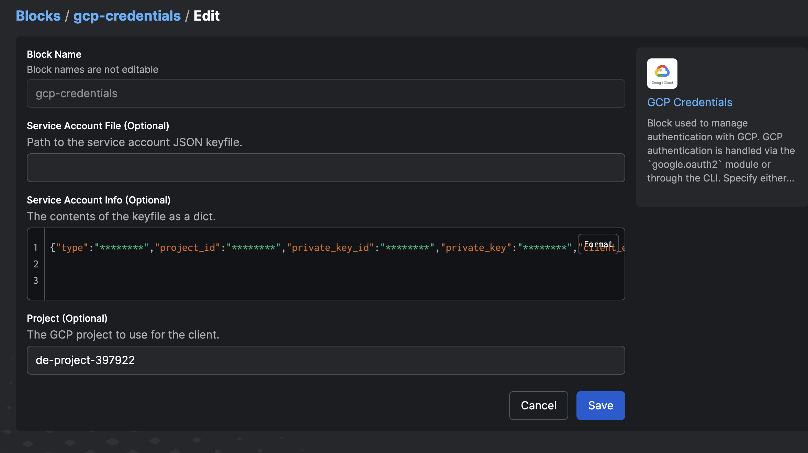
<p align='center'>Authorize connection to Google Cloud Platform services with the Account Service key</p>

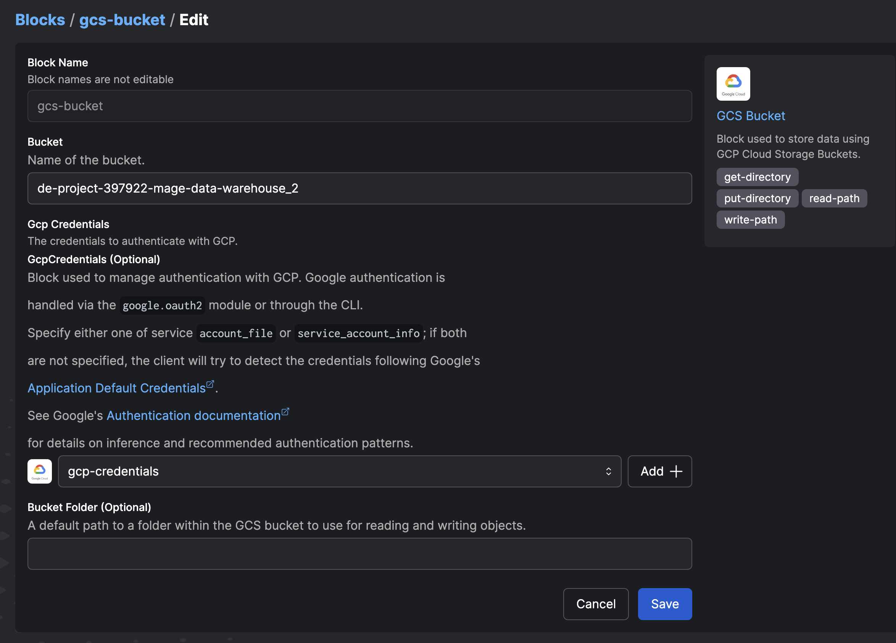
<p align='center'>Creating a new Block in Prefect using the created credentials</p>

Hence the blocks created are:

* GCS Bucket: `gcs-bucket`

* GCp Credentials: `google-creds`
   
The files for creating GCS buckets are found in the folder `chapter_3` and `chapter_4` in the repo. [ETL files](Data_Engineering/week_2_workflow_orchestration/chapter_3)


<p align='center'>GCS-bucket and Google credential blocks created</p>

# Pipelines in Python

We will be creating Python scripts to perform the three steps of the ETL (Extract, Transform, Load) process. These scripts will handle downloading the CSV file from the repository to the local machine and ingesting it into our BigQuery database. 

To ensure these scripts are interpreted as Prefect workflows, we will add the @flow and @task decorators. It is important to include all the necessary libraries in the imports, especially those related to Prefect.

etl_web_to_gcs.py will Download CSV, impart, export to Parquet and upload to Cloud Storage.

We have a pipeline called `etl_web_to_gcs.py` that performs data extraction. It consists of two extraction methods:

1. `Extract_data_local`: This method downloads the CSV file to a local directory.
2. `Extract_data_gcs`: This method loads the CSV file transformed to parquet format into Cloud Storage.

The method decorated with `@flow()` serves as the orchestrator, defining the dependencies between tasks and coordinating the execution of the extraction methods.

For more information, please refer to the [Prefect documentation](docs.prefect.io).

```python
# from matplotlib.textpath import text_to_path
import pandas as pd
from prefect import task, flow
from prefect_gcp.cloud_storage import GcsBucket
from prefect.tasks import task_input_hash
from datetime import timedelta
import os

@task(name='download data from url', log_prints=True, retries=3, cache_key_fn=task_input_hash, cache_expiration=timedelta(days=1))
def extract(data_url : str)-> pd.DataFrame:
    """  
    Download data from url and return a dataframe.

    :param df: pd.DataFrame 
    :return df: pd.DataFrame
    """
    df: pd.DataFrame = pd.read_csv(data_url)#,parse_dates=[["tpep_pickup_datetime"],"tpep_dropoff_datetime"])
    print(df.head())
    return df

@task(name='transformer', log_prints=True)
def transform(df: pd.DataFrame)-> pd.DataFrame:
    """
    Transform/remove 0 passenger counts"

    :param df: pd.Dataframe 
    :return df: pd.DataFrame
    """
    
    print(f"\n*** Pre: missing passenger count: {df['passenger_count'].isin([0]).sum()}")
    df = df[df['passenger_count'] != 0]
    print(f"\n*** Post: missing passenger count: {df['passenger_count'].isin([0]).sum()}")
    return df

@task(name="loader",log_prints=True,) # set to True so that the result is logged in Prefect Cloud
def write_to_local(df:pd.DataFrame, path: Path)->None:
    """  
    Persist the transformed dataset to local

    :param df: Dataframe 
    :return None: None
    """

    df.to_parquet(path, compression='gzip')
 
    return path

@task(name="loader",log_prints=True,) # set to True so that the result is logged in Prefect Cloud
def load(df:pd.DataFrame, path: Path)->None:
    """  
    Load the transformed dataset to Gsc Bucket

    :param df: Dataframe 
    :return None: None
    """

    gcs_block = GcsBucket.load("gcs-bucket")
    gcs_block.upload_from_path(from_path=path,
                            to_path=path)
    return 

@flow(name='main etl', log_prints=True)
def main() ->None:
    """  
    Main ETL pipeline

    :return None: None
    """
    color = 'yellow'
    year = 2020
    month = '07'
    data_file: str = f"{color}_tripdata_{year}-{month}" 
    data_url: str = f"https://github.com/DataTalksClub/nyc-tlc-data/releases/download/{color}/{data_file}.csv.gz"
    os.makedirs(Path(f"new_data/{color}/"), exist_ok=True)
    path = Path(f"new_data/{color}/{data_file}.parquet")   

    df: df.DataFrame = extract(data_url)
    df: df.DataFrame = transform(df)
    path = write_to_local(df,path)

    load(df, path)

if __name__=='__main__':
    main()
```

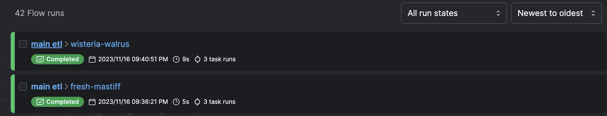
<p align='center'>Flow executions in Prefect</p>

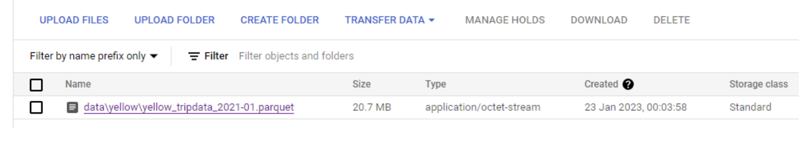
<p align='center'>Parquet stored in Cloud Storage</p>

The pipeline `etl_web_to_gcs.py` is a Prefect flow that downloads a CSV file from a URL, transforms it, and uploads it to a Google Cloud Storage bucket. The flow consists of three tasks:

1. `extract`: Downloads the CSV file from the URL and returns a DataFrame.
2. `transform`: Removes rows with zero passenger counts from the DataFrame.
3. `load`: Writes the transformed DataFrame to a local directory and uploads it to the Google Cloud Storage bucket.
4. `main`: Orchestrates the flow by defining the dependencies between tasks and executing them in the correct order.


etl_gcs_to_bq.py script, ingest parquet into BigQuery from Cloud Storage.

```python
import pandas as pd
from pathlib import Path
from prefect import flow, task
from prefect_gcp import GcsBucket, GcpCredentials
from prefect_gcp.bigquery import BigQueryWarehouse
from prefect.tasks import task_input_hash
from datetime import timedelta 
import io
from sqlalchemy import text
from google.cloud.exceptions import Conflict

@task(name='extractor', log_prints=True, retries=0, cache_key_fn=task_input_hash, cache_expiration=timedelta(days=1))
def extract(path : str)->pd.DataFrame:
    """  
    Extracts data from gcs path

    :param path: gcs path containing data 
    :return df: pd.Dataframe
    """
    gcs_block = GcsBucket.load("gcs-bucket")
    data = gcs_block.read_path(path)
    data_bytes = io.BytesIO(initial_bytes=data)
    df: pd.DataFrame = pd.read_parquet(data_bytes)
    print(f"df {type(df)} \n {df.head()}")
    return df


@task(name='transformer', log_prints=True)
def transform(df: pd.DataFrame)-> pd.DataFrame:
    """  
    Transform/remove 0 passenger counts"

    :param df: pd.Dataframe 
    :return df: pd.DataFrame
    """

    print(f"\n*** Pre: missing passenger count: {df['passenger_count'].isin([0]).sum()}")
    df = df[df['passenger_count'] != 0]
    df["tpep_pickup_datetime"] = pd.to_datetime(df["tpep_pickup_datetime"])
    df["tpep_dropoff_datetime"] = pd.to_datetime(df["tpep_dropoff_datetime"])
    print(f"\n*** Post: missing passenger count: {df['passenger_count'].isin([0]).sum()}")
    return df


@task(name='create gbq table schema', log_prints=True)
def create_gbq_table_schema(df:pd.DataFrame, tableName:str)-> None:
    """
    Create table schema in google BigQuery

    :param df: pd.Dataframe 
    :param tableName: name of table in Google BigQuery

    :return None: None
    """

    query = pd.io.sql.get_schema(df, tableName)
    create_schema = text(query.replace('"','').replace('REAL', 'FLOAT64').replace('TEXT', 'STRING'))
    print(f"Creating schema \n{create_schema}\n")
    bigquery_warehouse_block = BigQueryWarehouse.load("gcs-bigquery")
    try:
        bigquery_warehouse_block.execute(create_schema.text)
    except Conflict as e:
        print(f"Table {tableName} already exists, skipping table creation.")
        pass
    return None

@task(name='load data to google BigQuery', log_prints=True)
def load_to_gbq(df:pd.DataFrame)-> None:
    """
    Load dataset to Google Big Query
    
    :param df: pd.Dataframe 
    :return None: None
    """
    
    gcp_crdentials = GcpCredentials.load("gcp-credentials")
    df.to_gbq(destination_table='de-project-397922.trips_data_all.rides',
              project_id='de-project-397922',
              credentials=gcp_crdentials.get_credentials_from_service_account(),
              chunksize=100_000,
              if_exists='append')
    return None

@flow(name='main flow', log_prints=True)
def main()-> None:
    """main etl task"""
    color = 'yellow'
    year = 2020
    month = 7
    data_file = f"{color}_tripdata_{year}-{month:02}" 
    path = f"new_data/{color}/{data_file}.parquet" 
    tableName = 'trips_data_all.rides'

    df: pd.DataFrame = extract(path)
    df: pd.DataFrame = transform(df)
    # create_gbq_table_schema(df,tableName)
    load_to_gbq(df)
    return None


if __name__=="__main__":
    main()
```


Before we can run it and ingest data into GCP, we need to create a table in BigQuery with the schema of the parquet file (which incorporates it in addition to the data itself). To do this, we must access the Google Cloud Platform portal and:

1. Select our project
2. In the side blade, click on BigQuery
3. Click on the button + Add Data
4. Select Google Cloud Storage as the source
5. In the Source section, select the parquet file that we have previously uploaded. Leave the Parquet format
6. In the Destination, choose a name for the dataset, for example: dezoomcamp
7. Define the name of the table: rides
8. If we access it from the BigQuery explorer, we can see that it has been loaded correctly. But what we want is to load it from our Prefect workflow, so we must truncate it.

Run the script with:

```shell
python etl_gcs_to_bq.py
```

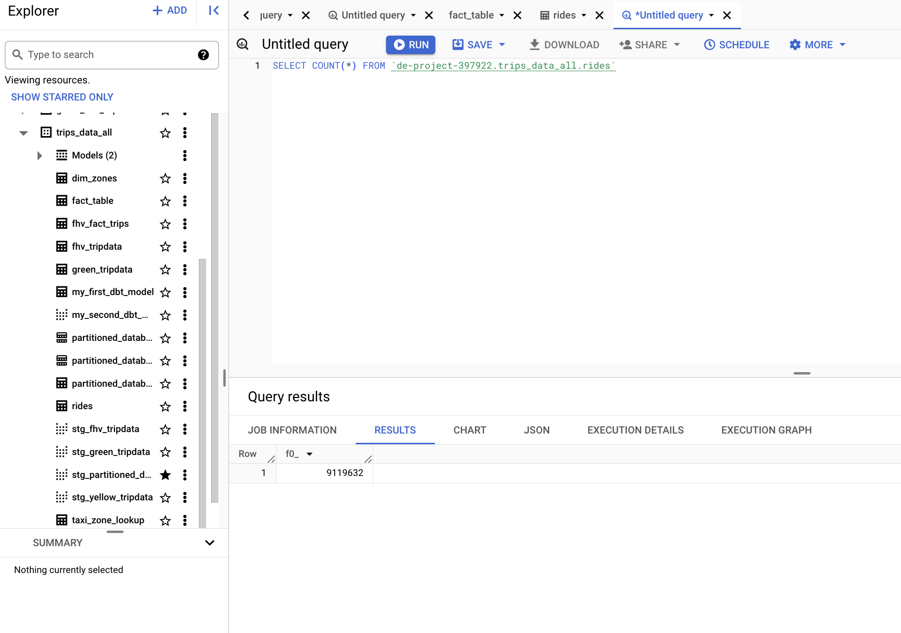
<p align='center'>GSC data loaded to GBQ</p>

# Parameterizing the Pipeline Flow

To automate ETLs, we need to parameterize the pipelines we have created. In line with the instructions provided in the videos, we have created a new file where we have copied the code from the two pipelines.
 
Our goal is to replace the hardcoded values for year, month, and color with parameters that will be received from a parent flow. This parent flow will be responsible for invoking the two flows: `etl_web_to_gcs` and `etl_gcs_to_bq`.

```python
# from matplotlib.textpath import text_to_path
import pandas as pd
from prefect import task, flow
from prefect_gcp.cloud_storage import GcsBucket
from prefect.tasks import task_input_hash
from datetime import timedelta
import os


#####
#ETL to GCS#
####

@task(name='download data from url', log_prints=True, retries=3, cache_key_fn=task_input_hash, cache_expiration=timedelta(days=1))
def extract_data(data_url : str)-> pd.DataFrame:
    """  
    Download data from url and return a dataframe.

    :param df: pd.DataFrame 
    :return df: pd.DataFrame
    """
    df: pd.DataFrame = pd.read_csv(data_url)#,parse_dates=[["tpep_pickup_datetime"],"tpep_dropoff_datetime"])
    print(df.head())
    return df

@task(name='transformer', log_prints=True)
def transform_data(df: pd.DataFrame)-> pd.DataFrame:
    """
    Transform/remove 0 passenger counts"

    :param df: pd.Dataframe 
    :return df: pd.DataFrame
    """
    
    print(f"\n*** Pre: missing passenger count: {df['passenger_count'].isin([0]).sum()}")
    df = df[df['passenger_count'] != 0]
    print(f"\n*** Post: missing passenger count: {df['passenger_count'].isin([0]).sum()}")
    return df

@task(name="loader",log_prints=True,) # set to True so that the result is logged in Prefect Cloud
def write_to_local(df:pd.DataFrame, path: Path)->None:
    """  
    Persist the transformed dataset to local

    :param df: Dataframe 
    :return None: None
    """

    df.to_parquet(path, compression='gzip')
 
    return path

@task(name="loader",log_prints=True,) # set to True so that the result is logged in Prefect Cloud
def load(df:pd.DataFrame, path: Path)->None:
    """  
    Load the transformed dataset to Gsc Bucket

    :param df: Dataframe 
    :return None: None
    """

    gcs_block = GcsBucket.load("gcs-bucket")
    gcs_block.upload_from_path(from_path=path,
                            to_path=path)
    return 

@flow(name='main etl', log_prints=True)
def etl_to_gcs(color: str, year: int, month: str) ->None:
    """  
    Main ETL pipeline

    :return None: None
    """
    data_file: str = f"{color}_tripdata_{year}-{month}" 
    data_url: str = f"https://github.com/DataTalksClub/nyc-tlc-data/releases/download/{color}/{data_file}.csv.gz"
    os.makedirs(Path(f"new_data/{color}/"), exist_ok=True)
    path = Path(f"new_data/{color}/{data_file}.parquet")   

    df: df.DataFrame = extract_data(data_url)
    df: df.DataFrame = transform_data(df)
    path = write_to_local(df,path)

    load(df, path)


### GCS to BigQuery####

@task(name='extractor', log_prints=True, retries=0, cache_key_fn=task_input_hash, cache_expiration=timedelta(days=1))
def extract(path : str)->pd.DataFrame:
    """  
    Extracts data from gcs path

    :param path: gcs path containing data 
    :return df: pd.Dataframe
    """
    gcs_block = GcsBucket.load("gcs-bucket")
    data = gcs_block.read_path(path)
    data_bytes = io.BytesIO(initial_bytes=data)
    df: pd.DataFrame = pd.read_parquet(data_bytes)
    print(f"df {type(df)} \n {df.head()}")
    return df


@task(name='transformer', log_prints=True)
def transform(df: pd.DataFrame)-> pd.DataFrame:
    """  
    Transform/remove 0 passenger counts"

    :param df: pd.Dataframe 
    :return df: pd.DataFrame
    """

    print(f"\n*** Pre: missing passenger count: {df['passenger_count'].isin([0]).sum()}")
    df = df[df['passenger_count'] != 0]
    df["tpep_pickup_datetime"] = pd.to_datetime(df["tpep_pickup_datetime"])
    df["tpep_dropoff_datetime"] = pd.to_datetime(df["tpep_dropoff_datetime"])
    print(f"\n*** Post: missing passenger count: {df['passenger_count'].isin([0]).sum()}")
    return df


@task(name='create gbq table schema', log_prints=True)
def create_gbq_table_schema(df:pd.DataFrame, tableName:str)-> None:
    """
    Create table schema in google BigQuery

    :param df: pd.Dataframe 
    :param tableName: name of table in Google BigQuery

    :return None: None
    """

    query = pd.io.sql.get_schema(df, tableName)
    create_schema = text(query.replace('"','').replace('REAL', 'FLOAT64').replace('TEXT', 'STRING'))
    print(f"Creating schema \n{create_schema}\n")
    bigquery_warehouse_block = BigQueryWarehouse.load("gcs-bigquery")
    try:
        bigquery_warehouse_block.execute(create_schema.text)
    except Conflict as e:
        print(f"Table {tableName} already exists, skipping table creation.")
        pass
    return None

@task(name='load data to google BigQuery', log_prints=True)
def load_to_gbq(df:pd.DataFrame)-> None:
    """
    Load dataset to Google Big Query
    
    :param df: pd.Dataframe 
    :return None: None
    """
    
    gcp_crdentials = GcpCredentials.load("gcp-credentials")
    df.to_gbq(destination_table='de-project-397922.trips_data_all.rides',
              project_id='de-project-397922',
              credentials=gcp_crdentials.get_credentials_from_service_account(),
              chunksize=100_000,
              if_exists='append')
    return None

@flow(name='main flow', log_prints=True)
def gsc_to_gbq(color: str, year: int, month: str)-> None:
    """main etl task"""

    data_file = f"{color}_tripdata_{year}-{month:02}" 
    path = f"new_data/{color}/{data_file}.parquet" 
    tableName = 'trips_data_all.rides'

    df: pd.DataFrame = extract(path)
    df: pd.DataFrame = transform(df)
    # create_gbq_table_schema(df,tableName)
    load_to_gbq(df)
    return None


@flow()
def etl_parent_flow(months: list[int] = [1,2], year: int = 2021, color: str = "yellow"):
    for month in months:
        etl_web_to_gcs(year, month, color)
        etl_gcs_to_bq(year, month, color)
    

if __name__ == "__main__":
    color="yellow"
    months=[1,2,3]
    year=2021
    etl_parent_flow(months, year, color)

```

# Prefect Deployments

A deployment in Prefect is a server-side artifact that encapsulates a flow and allows it to be programmed or launched via API.
Deployments serve as containers with metadata that include all the necessary components for a flow to be executed. They can be created either through the command line or programmatically using Python.
A flow can be associated with multiple deployments, providing flexibility and scalability in managing and executing workflows.

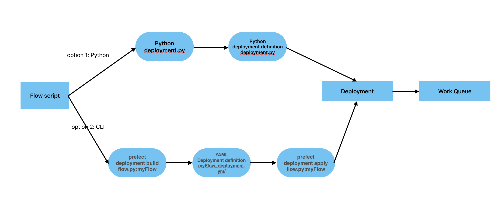


## Create Prefect Deployment by python

A convenient way to create a deployment is by building a Python script that specifies the necessary properties. By instantiating the class, we can create a new deployment by providing the flow to be executed, the name, the storage or infrastructure (if running on a Docker image), and the entrypoint (if specifying the location of the flow file).

In the following example, we create a deployment specified in (deployment.py) file to run a flow stored in a GitHub repository:

1. After defining the blocks and creating the parameterized script, the next step is to create the deployment. Use the command line to build the Prefect deployment.


```python
from prefect.deployments import Deployment
from etl_to_gcs import main_flow 
from prefect.filesystems import GitHub

github_block = GitHub.load("github-block")

deployment = Deployment.build_from_flow(
            flow=main_flow,
            name="github-deploy-code",
            version="1.0",
            storage=github_block,
            entrypoint='week_2_workflow_orchestration/homework/etl_to_gcs.py:actual_runner'
            )

if __name__=='__main__':
    deployment.apply()
```

To create the deployment, run the Python script in the terminal:

```shell
python deployment.py
```

# Create Prefect Deployment by CLI (command line)

If we create a command line deployment, we must use and pass the pipeline file as a parameter, separated by a colon and the flow name.

```shell
   prefect deployment build parameterized_flow.py:etl_grandparent_flow -n "Parameterized ETL" -a
   ```

To explain the command:

```shell
prefect deployment build python_file.py:flow_name -n "name of deployment"
```

 or 

```shell
prefect deployment build python_file.py:flow_name -n "name of deployment" -a
```

The tag:  `-a` to apply at the same time.

When we successfully execute the command, a file is created with all the metadata necessary to program the flow. We can modify and adapt it if necessary. In our case, we want to schedule it to run months 1, 2, and 3 of 2021 for the color yellow.

This creates a deployment YAML file: `prefect deployment apply etl_grandparent_flow-deployment.yaml`. You can edit the flow parameters in the YAML file or in the Prefect UI to change the flow variables: `{"color": "yellow", "months": [1, 2, 3], "year": 2021}`.

```yaml
###
### A complete description of a Prefect Deployment for flow 'parent_flow_runner'
###
name: Parameterized ETL
description: null
version: ab7f5ea6b27bb55f437f99ae11361a7c
# The work queue that will handle this deployment's runs
work_queue_name: default
work_pool_name: null
tags: []
parameters: {"color":"yellow", "month":7, "year":2020}
schedule: null
is_schedule_active: null
infra_overrides: {}
infrastructure:
  type: process
  env: {}
  labels: {}
  name: null
  command: null
  stream_output: true
  working_dir: null
  block_type_slug: process
  _block_type_slug: process

###
### DO NOT EDIT BELOW THIS LINE
###
flow_name: parent_flow_runner
manifest_path: null
storage: null
path: /Users/air/Documents/a_zoom_data_engineer/week2/chapter_2
entrypoint: parameterized_flow.py:etl_grandparent_flow
parameter_openapi_schema:
  title: Parameters
  type: object
  properties:
    month:
      title: month
      position: 0
      type: integer
    year:
      title: year
      position: 1
      type: integer
    color:
      title: color
      position: 2
      type: string
  required:
  - month
  - year
  - color
  definitions: null
timestamp: '2023-11-16T22:14:33.871657+00:00'
triggers: []
enforce_parameter_schema: null
```

Once the yaml has been modified, we can apply the deployment with the command:

```shell
prefect deployment apply etl_grandparent_flow-deployment.yaml
```

To access the deployment we just created, we can navigate to the Prefect GUI at http://127.0.0.1:4200/deployments. In the Deployments section, locate the deployment and click on the Run button. From the popup menu, select Quick Run to specify new parameter values for the run.

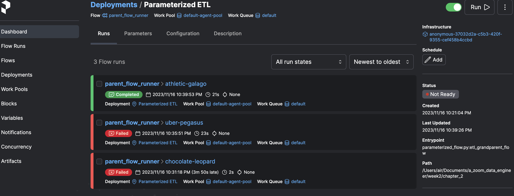
<p align='center'>Prefect deployment</p>

When executing the Deployments, a Work Queue is created that will be responsible for executing them. However, it starts in a dormant state. To activate it, you need to execute the following command:

```shell
prefect agent start -pool "default-agent-pool" --work-queue "default" 
```

The Work Queue that is generated has the default name and if we access it we can copy the command to start it.

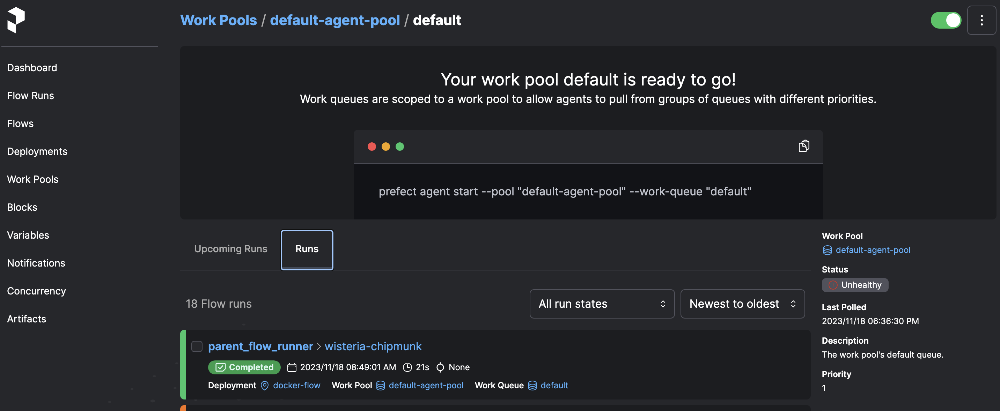
<p align='center'>Prefect's Work Queues</p>

Once we start the agent by command line, we observe that it starts executing the Deployment. We can also see the logs in the Prefect GUI.

# Orchestration using Docker via a Dockerfile deployment

When deploying a flow using Docker, you need to create a Dockerfile that specifies the environment and dependencies required to run the flow. This Dockerfile will be used to build a Docker image that contains the flow and its dependencies.

First of all, we create a docker-requirementes.txt that specifies the dependencies required to run the flow. This file is used to install the dependencies when building the Docker image.

```txt
pandas==1.5.2
prefect-gcp[cloud_storage]==0.2.3
protobuf==4.21.11
pyarrow==10.0.1
pandas-gbq==0.18.1
```

And then we went on to create the :dockerfile

a. Create Dockerfile

```dockerfile
FROM prefecthq/prefect:2.7.7-python3.9

COPY docker-requirement.txt .

RUN pip install -r docker-requirement.txt --trusted-host pypi.python.org --no-cache-dir

COPY chapter_2 /opt/prefect/flows

COPY chapter_2/new_data /opt/prefect/data
```

b. Build the docker image:
`docker build -t albydel/prefect:DE .`

c. Push docker image to dockerhub, but first sign in to docker hub with command

```shell
docker login
```

then push the image to docker hub

```shell
docker image push albydel/prefect:DE
```

6; Create docker block with the Prefect UI and define these parameters:

* Block Name: `zoom`
  
* image: `albydel/prefect:DE`
  
* image pull policy: `Always`

* auto remove: `true`

image pull policy always ensures that the image is always pulled from the repository.

auto remove sets the container to remove itself after the task is completed.

We create a Docker Container block, specifying the name and the image name and tags of the image we have just published 'albydel/prefect:DE`.

The files are here:

[Flow scripts](/Data_Engineering/week_2_workflow_orchestration/chapter_3/flows)

1; To create a DockerContainer block in code, you can use the DockerContainer class from the prefect.infrastructure.container module.

```python
from prefect.infrastructure.container import DockerContainer

docker_block = DockerContainer(
    image="albydel/prefect:DE",
    image_pull_policy="ALWAYS",
    auto_remove=True,
    network_mode="bridge"
)
docker_block.save("zoom", overwrite=True)
```

2; Create a deployment python file called `docker_deployment.py` to instantiate the Docker block in Prefect.
This parameterized flow is in chapter 4.

```python
from prefect.deployments import Deployment 
from prefect.infrastructure.container import DockerContainer
from parameterized_flow import etl_grandparent_flow

docker_block = DockerContainer.load("zoom")

docker_deploy = Deployment.build_from_flow(
    flow=etl_grandparent_flow,
    name="docker-flow",
    infrastructure=docker_block
)

if __name__ == "__main__":
    docker_deploy.apply()
```

1. Run the deployed task

Running this file will deploy the flow using the Docker block created in the previous step.

```shell
python docker_deployment.py
```

If we run it, we can connect to the GUI to check that the deployment has been created correctly.

4. Checking the profile, it shows that we are using the default profile

```shell
prefect profile ls
```

To verify that we are connected to the default profile, we can use the following command. Our goal is to replace the ephemeral local API with the API that the agent starts on boot. We can configure the API to use by running the command and providing the URL of the API that Prefect displays when it starts.

1. Use the API endpoint to enable the Docker container to interact with the Prefect server

```shell
prefect config set PREFECT_API_URL="http://127.0.0.1:4200/api"
```

6. Start the API agent. The agent picks up any queue and executes it.

```shell
prefect agent start --work-queue "default"
```

7. Run the queue with the parameter `month=7`

```shell
prefect deployment run parent_flow_runner/docker-flow -p "month=7" -p "color=yellow" -p "year=2020"
```

```txt
ValueError: Path /root/.prefect/storage/44bf1741162a49e8a0a878cc4a87824e does not exist.
12:45:05.414 | ERROR   | Flow run 'camouflaged-dragonfly' - Finished in state Failed('Flow run encountered an exception. ValueError: Path /root/.prefect/storage/44bf1741162a49e8a0a878cc4a87824e does not exist.\n')
```

When executing the command it throws an error that it does not find the Prefect volume. The solution is to remove the cache function from the task ingest_data function. To do this, we delete the cachkey function. The image needs to be rebuilt and published to the Docker Hub.

and run again with

```shell
prefect deployment run parent_flow_runner/docker-flow -p "month=7" -p "color=yellow" -p "year=2020" "cache_key_fn=task_input_hash, cache_expiration=timedelta(days=1)
```

If everything has gone well, we can see through the agent console or from the Prefect GUI that both the master flow and the children have been executed correctly (there are two of each because when executing the deployment in the parameters we have passed an array with two values: 1,2): `etl-parent-flow`, `etl-web-to-gc`, `etl-gcs-to-bq`


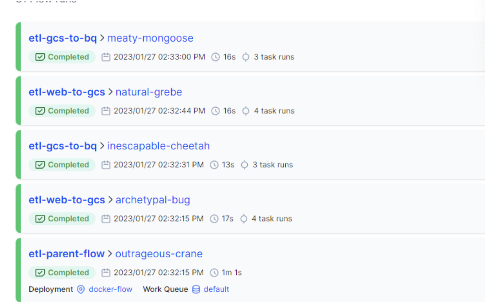
<p align=''></p>


# Prefect cloud

Prefect cloud is a 
* cloud-based orchestration platform that allows you to manage and monitor your flows from a centralized location.
* It provides a user-friendly interface for creating, deploying, and monitoring flows, as well as managing infrastructure and agents.
* Prefect Cloud also offers advanced features such as version control, collaboration tools, and integrations with other services.
* It is a paid service that offers a free tier with limited features and usage.

So far, we have launched the pipelines from the local Prefect server that we raised when executing the code. Alternatively, we can deploy and launch the flow on [Prefect Cloud's SaaS](https://app.prefect.cloud/). In addition, we have Automations at our disposal, which are triggers that we can use, for example, to notify when a flow has been executed correctly or not. Registration is free, and the interface is practically identical to the local GUI.

To use prefect cloud, you need to create an account and obtain an API key. You can then log in to the Prefect Cloud platform using the API key and create and manage your flows.

Follow these steps:

1. Go to prefect cloud and create API keys

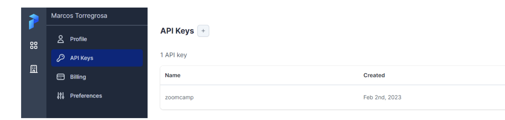
<p align='center'>Prefect Cloud</p>

2. Login with the API key with commmand
    
```shell
prefect cloud login -k <API_KEY>
```

3; Create `docker block`, `bigquery block`, `gcs bucket block`, `gcp credentials`
Prefect also allows you to create a github block to run your flows from github. This is done by creating a github block in the prefect UI and specifying the github repository and branch from which the flow will be run.

We create the blocks that we had previously created in the local instance of Prefect Orion. We can create them from the GUI or by CLI (python scripts). At this point we must take into account that the catalog of blocks available is different from the one we had locally. For example, we do have the Github and GCS Credentials blocks at our disposal, but the GCS Bucket block does not appear, instead we have another one called GCS. After thinking about it a lot, I finally threw the question into slack and Jeff gave me the clue. Even if a block doesn't appear in the Prefect Cloud catalog, we can create it manually from a python script! and voila:

```python
from prefect_gcp import GcpCredentials
from prefect_gcp.cloud_storage import GcsBucket

    bucket_block = GcsBucket(
    gcp_credentials=GcpCredentials.load("zoom-gcp-creds"),
    bucket="dtc_data_lake_digital-aloe-375022",
    )

bucket_block.save("zoom-gcs", overwrite=True)
```

And we run the script:

```shell
python gcp_bucket_block.py
```

If we access the blocks in Prefect Cloud we should see the Github, GCP Credentials, GCS Bucket:

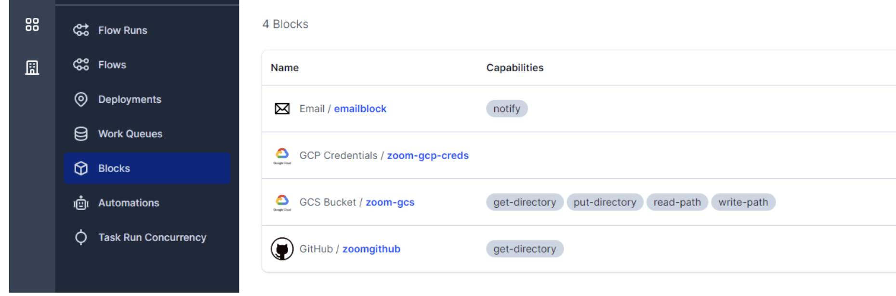
<p align='center'>Block Prefect Cloud</p>

3; We create a script for the Deployment. In the example we are going to use a flow that is downloaded from a repo on Github, for which it is connected through the corresponding block

```python
from prefect.deployments import Deployment
from etl_to_gcs import main_flow 
from prefect.filesystems import GitHub

github_block = GitHub.load("github-block")

deployment = Deployment.build_from_flow(
            flow=main_flow,
            name="github-deploy-code",
            version="1.0",
            storage=github_block,
            entrypoint='week_2_workflow_orchestration/homework/etl_to_gcs.py:actual_runner'
            )

if __name__=='__main__':
    deployment.apply()
```

After this step, you can see your flows in the  UI

To run the flow, activate the agent first with the command:

```shell
prefect agent start --work-queue "default" --no-cloud-agent
```

Then run the deployment with the command:

```shell
prefect deployment run parent_flow_runner/docker-flow -p "month=7" -p "color=yellow" -p "year=2020"
```

# Prefect Cloud Automations

As I mentioned before, Prefect Cloud automations are like triggers that perform one action as a consequence of another. We can configure them to respond to the execution cycle of a flow or to check the status of the Prefect agent. The available actions are:

* Cancel Flow
* Stop programming
* Stop Agent
* Continue programming
* Continue Agent
* Run deployment
* Send notification
  
For our example we're going to use the last one, send notification. We are going to create an automation that sends an email when any flow of our workspace is successfully finished. To do this, first of all, we must create an email-type block:

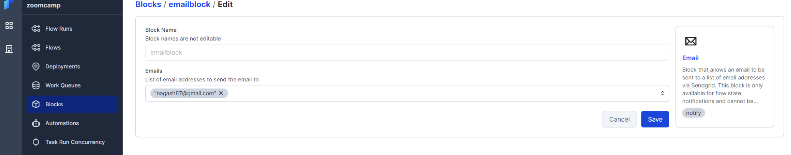


Now we'll create the automation of type Flow run state (we want it to be triggered when a flow is executed). For all flows whose status is changed to Completed:


Select the previously created email block and we could modify the email body:

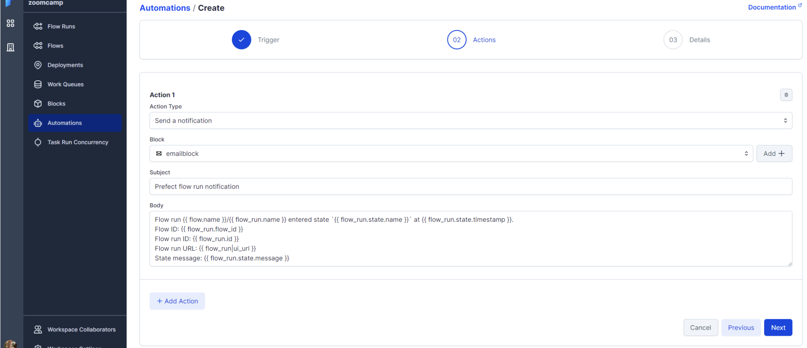


If we execute a deployment or flow, if it ends successfully we will receive an email from Prefect with the communication.

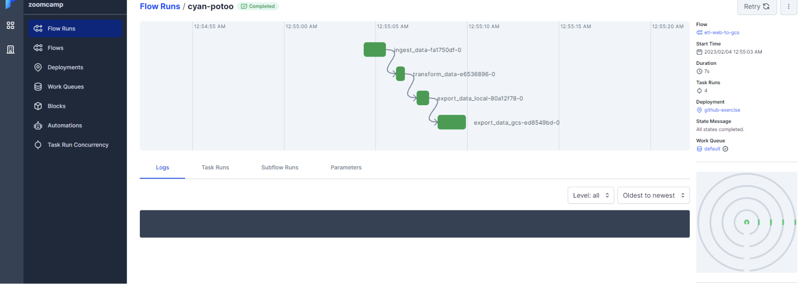


# Orchestrating dataflow with Mage

Mage is an open-source, hybrid framework for transforming and integrating data. It is designed to simplify the process of building data pipelines by providing a unified interface for defining, orchestrating, and monitoring data workflows.

# Mage setup

This repo contains a Docker Compose template for getting started with a new Mage project. It requires Docker to be installed locally.

You can start by cloning the repo:

```bash
git clone https://github.com/mage-ai/mage-zoomcamp.git mage
```

Navigate to the repo:

```shell
cd mage
```

Rename dev.env to simply .env— this will ensure the file is not committed to Git by accident, since it will contain credentials in the future.

Define secretes in `.env` file

Edit the docker-compose.yml with path to GCP.json credential

Now, let's build the container

```shell
docker compose build
```

Finally, start the Docker container:

```bash
docker compose up
```

Now, navigate to <http://localhost:6789> in your browser! Voila! You're ready to get started with the course.

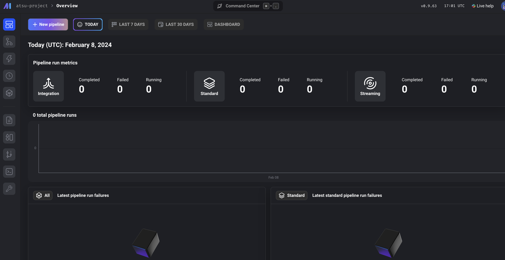

Define docker postgress connector in `io_config.yml` in mage files. the postgres instance is defined in docker

```yml
dev:
  POSTGRES_CONNECT_TIMEOUT: 10
  POSTGRES_DBNAME: "{{ env_var('POSTGRES_DBNAME') }}"
  POSTGRES_SCHEMA: "{{ env_var('POSTGRES_SCHEMA') }}" # Optional
  POSTGRES_USER: "{{ env_var('POSTGRES_USER') }}"
  POSTGRES_PASSWORD: "{{ env_var('POSTGRES_PASSWORD') }}"
  POSTGRES_HOST: "{{ env_var('POSTGRES_HOST') }}"
  POSTGRES_PORT: "{{ env_var('POSTGRES_PORT') }}"
  
```

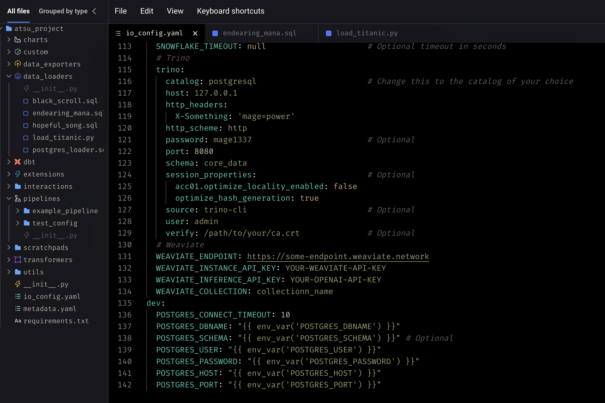
<p align='center'>specifying the postgress connector</p>

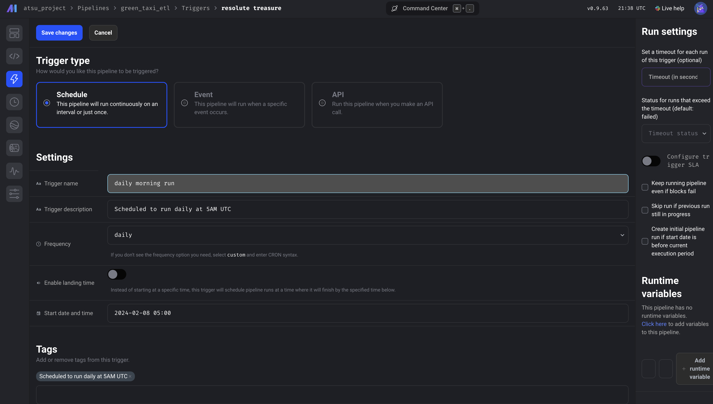
<p align='center'>testing the docker postgres connection</p>

->Back: [Lesson 1: Introduction to Data Engineering](1_introduction.md)

->Next: [Lesson 3: Data Warehouse](3_data_warehouse.md)