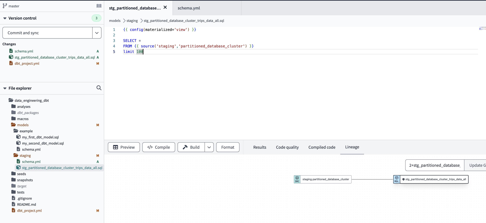
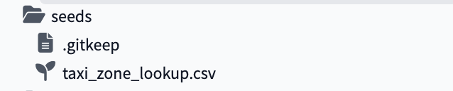
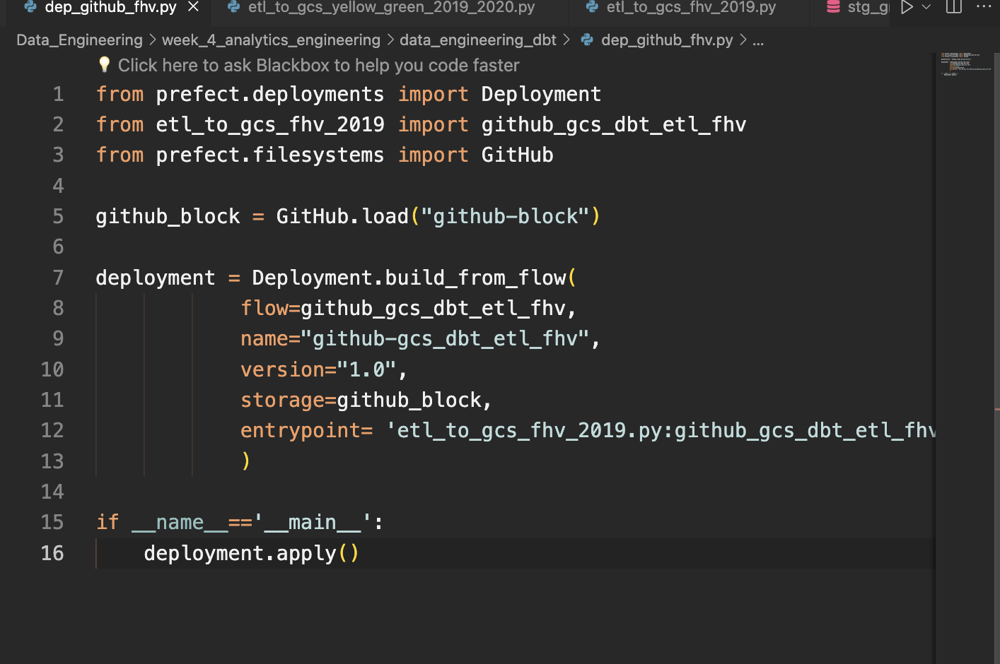

->Back: [Lesson 3: Data Warehouse](3_data_warehouse.md)

->Next: [Lesson 5: Batch Processing](5_batch_processing.md)


# Table of contents

- [Table of contents](#table-of-contents)
- [Analytics Engineering](#analytics-engineering)
  - [Data Build Tool (dbt)](#data-build-tool-dbt)
  - [Some of the main features of dbt](#some-of-the-main-features-of-dbt)
  - [How to get started with dbt?](#how-to-get-started-with-dbt)
  - [Install dbt Core with PIP](#install-dbt-core-with-pip)
  - [create new python environment](#create-new-python-environment)
  - [Install dbt Core with a Docker image](#install-dbt-core-with-a-docker-image)
  - [Create project in DTB Cloud](#create-project-in-dtb-cloud)
  - [Create service account + JSON Key for Big Query](#create-service-account--json-key-for-big-query)
  - [Create a BigQuery service account](#create-a-bigquery-service-account)
  - [Creating first dbt project](#creating-first-dbt-project)
- [How to setup dbt cloud with bigquery](#how-to-setup-dbt-cloud-with-bigquery)
  - [Create a dbt cloud project](#create-a-dbt-cloud-project)
  - [Add GitHub repository](#add-github-repository)
  - [Review your project settings](#review-your-project-settings)
  - [(Optional) Link to your github account](#optional-link-to-your-github-account)
  - [DBT Model](#dbt-model)
  - [The FROM clause in a dbt model](#the-from-clause-in-a-dbt-model)
  - [Macros](#macros)
  - [Package](#package)
  - [Variables](#variables)
  - [Seed](#seed)
- [Use Case](#use-case)
  - [6.1 Run the dbt model](#61-run-the-dbt-model)
  - [7.1 run dbt command](#71-run-dbt-command)
  - [8.1 Run the dbt command](#81-run-the-dbt-command)
  - [9.1 Run the dbt command](#91-run-the-dbt-command)
  - [Merge all](#merge-all)
  - [Run dbt command](#run-dbt-command)
  - [NB](#nb)
- [NB](#nb-1)
- [DBT test](#dbt-test)
- [dbt production environment](#dbt-production-environment)
- [Continuous integration](#continuous-integration)
- [Visualizing the data with google looker studio](#visualizing-the-data-with-google-looker-studio)
- [Reports in Google Data Studio (reports)](#reports-in-google-data-studio-reports)


# Analytics Engineering


<p align="center">Data roles</p>


| Kimball| Inmon| Data Vault|
|---|---|---|
|Integrate datamarts into a centralized data warehouse. It is based on the Business Dimensional Lifecycle conceptStructure of dimensions and facts of the conglomerate of datamarts that are part of the DWH. The bus structure is responsible for joining these entities between the datamarts through the conformed dimensions. Separation between data processing and reporting (historical data). Iterative approach: Allows you to improve and adjust your data warehouse as more information is gained and new business requirements are identified. Boot up very fast, but each new iteration requires a lot of effort.Prioritize data delivery over data redundancy control (3FN)| Data must be integrated and consolidated from all sources into a central data warehouse to provide a single view of the data. An Inmon system must meet four standards. Topic: All data related to the same topic is stored together. Integration: the information of all the source systems is stored in a central data warehouse, managing the relationship between them. Non-volatile: Data is set in stone and never erased. Variable time: a history of the data is maintained so that you can consult a photo with the actual data at that time. The Inmon approach prioritizes an accurate and consistent data warehouse, so the greatest effort is made at the last layer.| It aims to address the weaknesses of the previous two approaches by focusing on flexibility in the face of changes in source systems. It seeks to be an efficient model, quick to implement and very dynamic. Detail orientation: maximum level of detail of the information. Historical: All changes to the data are stored.Set of standard tables: The model is built on the basis of three main types of tables: Hub: Entities of interest to the business. They contain the business keys and their metadata. Link: relationships between Hubs. Satellite: historical store of information from the Hubs. Hard and Soft Rules: Business rules have two layers, the hard layers that are immutable and the technical ones that facilitate changes|

|Kimball|Inmon|Data Vault|
|---|---|---|
| Multidimensional | Relational |  Relational |
|Star Model: Facts + Dimensions |  Snowflake Model: Entity-Relationship | Star Model on Last Layer Mart |
| Bottom-Up Process: The central Data Warehouse is the aggregation of different datamarts with their truths already calculated. First the datamarts are generated and then the DWH.| Top-Down Process: A single truth of the data managed in the central Data Warehouse and distributed to the different datamarts.| Top-Down process: data goes through several layers (data source, data lake, staging, and finally data vault).
| Conformal data dimensions: Tables of identical dimensions or a centralized one in the DWH are used to connect data between datamarts uploaded to the DWH to maintain data consistency.| Data at the highest level of detail | Data at the highest level of detail|
| Historical data is stored in a location other than the central DWH. |Using SCD (slowing changing dimension) to control historical data | Use of SCD2 (slowing changing dimension) in Satellite tables.|
Denormalized | Standard | Standard|
Yes, it allows for data redundancy in order to optimize data processing| No data redundancy |No data redundancy|

<p align='center'>Comparison between Kimball vs Inmon vs Data Vault methodologies</p>

## Data Build Tool (dbt)


dbt (Data Build Tool) is an open-source Python library that streamlines the construction of data models by allowing developers to define, orchestrate, and execute transformations in a modern data warehouse such as BigQuery, Snowflake, Redshift, etc. We could say that it is a governance tool focused on the "T" of an ETL/ELT process, it allows us to centralize and build all data transformations in SQL, organizing them as reusable modules (models). On the other hand, by being inspired by software engineering practices, we can create validation tests and implement the entire CI/CD cycle in our data pipelines. In parallel to the knowledge provided by the Bootcamp, the [official introductory](https://courses.getdbt.com/courses/fundamentals) course (duration: 5 hours) is very interesting.

In my previous professional period, the logic was divided into procedures stored in the SQL Server database, SQL queries in the ETLs (Azure Data Factory, SSIS and Taled) and even in the load models of the visualization tools (Qlikview and Power BI). It wasn't documented anywhere. What dbt brings to this paradigm is a governance or control layer that facilitates the maintenance and documentation of logic, lineage, increased resilience and collaboration thanks to version control, and finally, would facilitate continuous integration/delivery or continuous deployment [CI/CD](https://www.getdbt.com/blog/adopting-ci-cd-with-dbt-cloud/).


<p align='center'>Integrated Data Architecture dbt as transformation softeware</p>

## Some of the main features of dbt

* **Code Reuse**: Allows the definition of data models and the organization of transformations into packages.
* **Emphasis on quality controls**: Encourages the use of automated testing to ensure data quality and prevent errors in transformations.
* **Version control and collaboration**: It is designed to work with version control systems such as Git, Bitbucket, etc., making it easy to track changes and collaborate in the development of data pipelines.
* **Scalability**: Designed to work with modern data warehouses such as BigQuery, Snowflake, Redshift, etc., it allows you to easily scale the processing of large volumes of data.

## How to get started with dbt?

There are two ways to use dbt for free:

* **dbt Core**: open-source version that is installed locally or on your own server. Interaction is per CLI console.
* **dbt Cloud** : cloud-hosted platform (SaaS) that offers additional functionalities to the Core version (execution scheduling, integrations with BI services, monitoring and alerting). It is easier to use because it has a GUI. In addition to the paid plans, it offers a limited free version for developers.

## Install dbt Core with PIP

We have several options to install dbt Core on our computer or local server, the easiest way is through a python environment.`pip`

```python
pip install dbt-core
```

Then we will install the adapter or connector of the database engine that we are going to use. We have at our disposal an official catalog and a complementary one of the community, you can consult all the available connectors [from here](https://docs.getdbt.com/docs/supported-data-platforms). In our case, we're going to install the **BigQuery adapter**.

```python
pip install dbt-bigquery
```

## create new python environment

```conda create -n dbt```

Create a new project by running the `dbt init` command. What this command does is clone the dbt [starter](https://github.com/dbt-labs/dbt-starter-project) project into the folder from where we have executed it, which contains all the files and directories necessary to start our project.

* `dbt_project.yml`: DBT project configuration file (name, profile that identifies the database engine we are going to use, such as PostgreSQL or BigQuery and global variables). If you are going to use dbt locally, you need to make sure that the profile indicated in this configuration file matches the one in the installation (~/.dbt/profiles.yml).

* `README.md`: File for literature in the REPO

* Directories analysis, data, macros, models, snapshots and tests

```python
dbt init
```


<p align='center'>Install dbt Core locally</p>

If everything has gone well, we will be able to configure our project through the console (CLI) to generate the profiles.yml file:


<p align='center'>Install dbt core locally</p>


<p align='center'>Check that all the files and directories of the dbt project have been generated in the path where we have executed the command</p>

## Install dbt Core with a Docker image

I recommend this [reading](https://github.com/dbt-labs/dbt-core/tree/main/docker) to delve deeper into this step. The images available for mounting a dbt container with Docker are:

* `dbt-core` (does not have database support)
* `dbt-postgres`
* `dbt-redshift`
* `dbt-bigquery`
* `dbt-snowflake`
* `dbt-spark`
* `dbt-third-party`
* `dbt-all` (installs all images into one)

```python
docker build --tag my-dbt  --target dbt-bigquery .
```

Once the image is created, we start the container:

```
docker run \
--network=host
--mount type=bind,source=path/to/project,target=/usr/app \
--mount type=bind,source=path/to/profiles.yml,target=/root/.dbt/profiles.yml \
my-dbt \
ls
```

## Create project in DTB Cloud

Before creating our first project in dbt Cloud, we must gather the necessary ingredients: create a service account, generate the JSON Key to grant dbt access to our BigQuery instance and create an empty repo on Github where the project's files and directories will be stored:

## Create service account + JSON Key for Big Query

Since in our case we are going to use BigQuery, the authentication is done by [BigQuery OAuth](https://docs.getdbt.com/docs/dbt-cloud/cloud-configuring-dbt-cloud/cloud-setting-up-bigquery-oauth). We need to create a service account from GCP and download the JSON key to grant dbt access.

1. We access the [Google Cloud Platform](https://cloud.google.com/gcp) console and go to **IAM and admin** > **Service accounts** to create a new **service account** with **BigQuery Admin** and **Storage Object Viewer** permissions.

## Create a BigQuery service account

In order to connect we need the service account JSON file generated from bigquery:

1. Open the [BigQuery credential wizard](https://console.cloud.google.com/apis/credentials/wizard) to create a service account in your taxi project

<table><tr>
<td>  </td>
<td>  </td>
</tr></table>

2. You can either grant the specific roles the account will need or simply use bq admin, as you'll be the sole user of both accounts and data.

*Note: if you decide to use specific roles instead of BQ Admin, some users reported that they needed to add also viewer role to avoid encountering denied access errors*

<table><tr>
<td>  </td>
<td>  </td>
</tr></table>

3. Now that the service account has been created we need to add and download a JSON key, go to the keys section, select "create new key". Select key type JSON and once you click on create it will get inmediately downloaded for you to use.

<table><tr>
<td>  </td>
<td>  </td>
</tr></table>

2. We downloaded the JSON Key to our team (later we will upload it in dbt in the project setup process).
Create a repository on Github

We simply create an empty repo on Github and click on **Git Clone** to copy the SSH key with which we will link the dbt project. The connection with Github is made in two parts, for now we are only interested in the key, later we will see how to configure the deploy key generated from **dbt**.


<p align='center'>We copied the SSH key from our Github repo to connect it with dbt</p>

Now we have the ingredients! We signed up for **dbt cloud** with the free option for one user from this [link](https://www.getdbt.com/pricing/). Once the email has been verified, we can create our project by choosing the data storage first.


<p align='center'>Creation of a new project in dbt (Data Build Tool)</p>

In the next step, we load the JSON Key that we have generated with the BigQuery service account and all the parameters are automatically loaded. It's a good idea to create the dataset in BigQuery manually to avoid cross-region incompatibility issues. In my case, I have used the name that has been generated by default and created the dataset directly.


<p align='center'>Configuring BigQuery dataset in dbt</p>

We do the connection test and if everything has gone well, the next step!

<p align='center'>Testing dbt connection with Google BigQuery</p>

Now it's time to set up the Github repository that we have previously created and perform the second step that we had pending. Select **Git Clone** and paste the SSH Key that we copied earlier. Press the **Import button**.


<p align='center'>Configuring Github with dbt</p>

It will generate a deployment key that we need to copy into the Github repository settings:


<p align='center'>Deployment key generated in dbt to connect to Github</p>

Going back to our Github repository, click on **Settings** and in the **Security** section click on **Deploy Keys** to add it. It is necessary to check the **Allow write access option**:


<p align='center'>display keys section on github repo</p>


<p align='center'>Configuring deploy Key on Github</p>


<p align='center'>Deploy Keys on Github</p>

If we click on the Next button in the dbt project settings, we're done:


<p align='center'>Configure dbt project</p>

We access Develop and we must initialize our project in dbt cloud (similar to the command we would run in dbt core):`dbt init`


<p align='center'>We initialized the dbt project</p>


<p align='center'>Newly created dbt project</p>

After waiting a few seconds, all the yml, SQL, and directories files in the dbt project are created. We must click on Commit and sync to push to our Github repo.
create a new branch to enter edit mode


Remember that since it is linked to a repo on github, if you want to work on the dbt cloud GUI you need to create a branch first. To execute any command from the GUI, we can use the console we have in the footer:
NB: Macros are functions


## Creating first dbt project

create schema in big query

* dbt_production

* dbt_sandbox

* dbt_staging


# How to setup dbt cloud with bigquery

[Official documentation](https://docs.getdbt.com/tutorial/setting-up)

## Create a dbt cloud project

1. Create a dbt cloud account from [their website](https://www.getdbt.com/pricing/) (free for solo developers)
2. Once you have logged in into dbt cloud you will be prompt to create a new project

You are going to need:

* access to your data warehouse (bigquery - set up in weeks 2 and 3)
* admin access to your repo, where you will have the dbt project.

 *Note: For the sake of showing the creation of a project from scratch I've created a new empty repository just for this week project.*


3. Name your project
4. Choose Bigquery as your data warehouse: 
5. Upload the key you downloaded from BQ on the *create from file* option. This will fill out most fields related to the production credentials. Scroll down to the end of the page and set up your development credentials.

*Note: The dataset you'll see under the development credentials is the one you'll use to run and build your models during development. Since BigQuery's default location may not match the one you sued for your source data, it's recommended to create this schema manually to avoid multiregion errors.*

<table><tr>
<td>  </td>
<td>  </td>
</tr></table>

6. Click on *Test* and after that you can continue with the setup

## Add GitHub repository

 *Note:* This step could be skipped by using a managed repository if you don't have your own GitHub repo for the course.

1. Select git clone and paste the SSH key from your repo.

 <table><tr>
<td>  </td>
<td>  </td>
</tr></table>

2. You will get a deploy key, head to your GH repo and go to the settings tab. Under security you'll find the menu *deploy keys*. Click on add key and paste the deploy key provided by dbt cloud. Make sure to tikce on "write access"

 <table><tr>
<td>  </td>
<td>  </td>
</tr></table>


## Review your project settings

At the end, if you go to your projects it should look some like this:


## (Optional) Link to your github account

You could simplify the process of adding and creating repositories by linking your GH account. [Official documentation](https://docs.getdbt.com/docs/dbt-cloud/cloud-configuring-dbt-cloud/cloud-installing-the-github-application)


<p align='center'>Configure dbt project</p>

Access the **Develop** tab and initialize the dbt project in cloud

<p align='center'>Initialize the project</p>


<p align='center'>Initializing the project creates the project files</p>

create a new branch to enter edit mode. You need to create a new bramch before editing the files.


## DBT Model

Creating a table in the target database with the `.sql` file: `SELECT`

```sql
{{ config(materialized='table') }}

SELECT * 
FROM staging.source_table
WHERE record_state = 'ACTIVE'
```

In addition to the query, a dbt model initially includes a block of code under the [Jinja](https://jinja.palletsprojects.com/en/3.0.x/) notation that we will recognize by the double brackets. Within this block is called the dbt function that is commonly used to specify the persistence strategy of the dbt model in the target database. By default, there are four ways to materialize queries, although it is possible to create your own: `{{ }}config()`

* `table` : Model data is persisted in a table above the warehouse.
* `view` : ditto to the previous one, but instead of a table it is a view.
* `incremental` : These models allow DBT to insert and/or update records in a database if they have changed since the last time it was run.`table`
* `ephemeral` : do not generate an object directly in the database, it creates a CTE (Common Table Expression), which is a temporary subquery to use in other queries (such as SQL Server).`WITH`

To construct the model that persists the query on a table in our database, we need to run the code above. If we don't add any parameters, it will compile and build all the models. To specify that we only want to build a specific one, we add the parameter `--select myMODEL.SQL`
Let's look at it with two examples:
`dbt build--select`

We run and build **`all`** the models:

```shell
dbt run
```

TO build only the `myModel.sql` we run:

```shell
dbt run --select myModel.sql
```

when we run the model, dbt compiles it into the following

```sql
CREATE TABLE my_schema.my_ymodel AS (
    SELECT *
    FROM staging.source_table 
    WHERE record_state = 'ACTIVE'
)
```

## The FROM clause in a dbt model

In addition to directly specifying the schema and table name, there are two ways to configure the data sources in the FROM clause in a dbt model: **`source`** and **`seeds`**.

Sources
They are used when the source is a database table (BigQuery, PostgreSQL...). The connection is configured in a `schema file.yml` that we must create in the same directory where the model is located. It is possible to indicate whether we want to periodically check whether the connection is operational or not (source freshness). When constructing the model, we substitute the **"schema.table name"** by a macro in jinja notation that will fetch this data from the yml configuration file. For example, the source `()` macro contains the name of the source indicated in the yml and the name of the table. `FROM`

```sql
{{ config(materialized='view') }}

SELECT *
FROM {{ source('staging','partitioned_database_cluster') }}
limit 100
```


<p align='center'>define .sql file stg_partitioned_database_cluster_trips_data_all</p>

The schema.yml file that we create in the same directory where the model is located contains the `version`, `source name`, `database`, `schema` and `tables`. One of the advantages of having the configuration in a separate file from the models is that it allows us to change the connection for all of them from a single place:

```yml
version: 2

sources:
  - name: staging
    database: de-project-397922
    schema: trips_data_all

    tables:
      - name: partitioned_database_cluster
      - name: partitioned_database
```


<p align='center'>define schema.yml. it specifies sources. sources contain database</p>

Therefore, in our dbt /models/ folder we will have a .sql file for each model and a `schema.yml` with the configuration of the sources.


<p align='center'>successful run of dbt model</p>


<p align='center'>view stg_partitioned_database_cluster_trips_data_all created</p>

## Macros

A dbt macro is similar to a function in any other language written in jinja notation. They are generated in separate .sql files in the /macros directory of the dbt project. As we have already mentioned, by default dbt has several macros such as , and , but we can create a new one that meets our needs. Some features of macros: `source()`,`ref()`, `config()`

* Allows you to add logic with loops and statements `FOR`, `IF`
* They can use environment variables defined at the project level in dbt
* Allows code to be reused between different models
* Use the result of another subquery in one query

We can use three different types of jinja blocks within a [macro](https://docs.getdbt.com/docs/build/jinja-macros):

* `Expressions` : when we want to return a string. Expressions can be used to reference variables or call other macros. 
 
```md
{{ }}
```


We use the macro in our dbt model:

```sql
{{ config(materialized='table') }}

SELECT 
    get_payment_type_description(payment_type)
FROM {{ source('staging','green_tripdata') }}
WHERE vendorid is not null
```

When we run the model, dbt compiles the code so that the generated table has translated the macro into a SQL: `CASE WHEN`

```sql
SELECT 
    case payment_type
        when 1 then 'Credit card'
        when 2 then 'Cash'
        when 3 then 'No charge'
        when 4 then 'Dispute'
        when 5 then 'Unknown'
        when 6 then 'Voided trip'
    end as payment_type_description
FROM {{ source('staging','green_tripdata') }}
WHERE vendorid is not null
```


<p align='center'>Macros defined in macros folder</p>


<p align='center'>implement macros 'function'</p>

## Package

It allows us to reuse macros between different projects, similar to libraries or modules in other programming languages. To use a `package` in our project we must create a `packages.yml` configuration file in the root directory of our dbt project.

```yaml
packages:
    - package: dbt-labs/dbt_utils
      version: 0.8.0
```


<p align='center'>define package</p>

download and install the package with dependences:

```s
dbt deps
```

Then we must install them by running the command that is responsible for downloading all the dependencies amd files of the package within our project.  Afterwards, the **dbt_packages/dbt_utils** directory will be created in our project. `dbt deps`


<p align='center'>generate surrogate keys with dbt_utils.generate_surrogate_key macro</p>

We can use the macros of the newly installed package in any model of our project. For example, the [dbt-utils](https://hub.getdbt.com/) package includes the macro to create a surrogate key (sequential id internal to the table).`surrogate_key`

```sql
{{ config(materialized='table') }}

SELECT
    {{ dbt_utils.surrogate_key(['vendorid', 'lpep_pickup_datetime']) }} as tripid,
    vendorid
FROM {{ source('staging','green_tripdata') }}
WHERE vendorid is not null
```

Dbt compiles this model by creating a surrogate key with a hash function:

```sql
SELECT
    to_hex(md5(cast(coalesce(cast(vendorid as string), '') || '-' 
        || coalesce(cast(lpep_pickup_datetime as string), '') as string))) as tripid,
    vendorid
FROM {{ source('staging','green_tripdata') }}
WHERE vendorid is not null
```

## Variables

Similar to the variables of any programming language. For the same purpose, it allows us to save a value and reuse it in any part of the project. They can be created in two ways:

* Create the variable in the dbt project configuration file (**dbt_project.yml**) located in the root directory adding:

```sql
vars:
    payment_type_values: [1, 2, 3, 4, 5, 6]
```

* On the command line when we build the models:

```sql
dbt build --var 'is_test_run: false'
```

The variable can be accessed from any other part of our project using `{{ var('...') }}`.

To use a variable we must use the macro within a model" `{{ var('...') }}`

```sql
{{ config(materialized='table') }}

SELECT *
FROM {{ source('staging','green_tripdata') }}


    limit 100


```


<p align='center'>implement variable. limits query to 100 when its a test run</p>


<p align='center'>Successful fun for dbt run --select stg_partitioned_database_cluster_trips_data_all</p>


<p align='center'>dbt run --select stg_partitioned_database_cluster_trips_data_all  --vars 'is_test_run : false'</p>

## Seed

Similar to the External Tables of BigQuery or Azure Synapse, we can reference any CSV file stored in the repository within the directory, as it is stored in a repo we can take advantage of its version control. It is recommended to use seeds for data that does not change frequently (parametric dimension tables, such as provinces). `/seeds`

Instead of using the macro as we have seen before for a database table, for seeds the macro is used that receives the file name as a parameter and dbt automatically detects the dependencies and their location. The macro can also be used to reference tables or DB views in the same way, just by parametering the name of the table. To create a seed, simply upload a CSV file to the /seeds directory of our repo and run the . If we were to run, all the CSVs in the directory would be loaded into the database. This command generates a table in our database, in
BigQuery:source()ref()ref()dbt seed taxi_zone_lookup.csvdbt seed

```
dbt seed taxi_zone_lookup.csv
```


<p align='center'>Add seed csv file into seeds folder. Either create the file in the folder and copy into it. or git add submodule the repo to local, add the file, commit, and then create pull request from the dbt UI</p>


<p align='center'>The CSV file</p>


<p align='center'>Running the dbt seed command</p>


<p align='center'>taxi_zone_lookup table created via the seed</p>

Now we can create a dbt model that refers to the newly created seed:

```sql
{{ config(materialized='table') }}

SELECT *
FROM {{ ref('taxi_zone_lookup') }}
```

If we want to change the the data types of seed data that by default have been inferred from the CSV, we must modify the project configuration file and add the seed block: `dbt_project.yml`

```sql
seeds:
    taxi_riders_ny:
       taxi_zone_lookup:
          +column_types:
              locationid: numeric
```


<p align='center'>To change the data types of data in the csv file </p>

If we want to recreate the seed, we must use the :
`dbt seed micsv.csv --full-refresh`


<p align='center'>Recreating the seed with full refresh</p>

```sql
{{ config(materialized='table') }}

select 
    locationid,
    borough,
    zone,
    replace(service_zone, 'Boro', 'Green') as service_zone
FROM {{ ref('taxi_zone_lookup') }}

```


<p align='center'>define a table referencing the seed table</p>

```sql
dbt run --select dim_zones
```


<p align='center'>Successfully created a table referencing the seed table</p>

```sql
dbt build 
```

would build all the models in our project

```sql
dbt build --select +dim_zones
```

This would select only the `dim_zones` model and build it along with its dependencies.

# Use Case

1. Upload the csv files into Google Cloud Store and them create the DBT moodels from them
Taxi racing datasets: I've left a Prefect script i.e `etl_to_gcs_yellow_green_2019_2020.py` and `etl_to_gcs_fhv_2019.py` in my github repository to upload all the files to GCS Bucket and then work with them in dbt and persist them in the BigQuery database.

* Yellow taxi data – Years 2019 and 2020

* Green taxi data – Years 2019 and 2020
* fhv data – Year 2019
* Lookup zone dataset: You can download it from my repository [here](https://github.com/dell-datascience/data_engineering_dbt/blob/master/seeds/taxi_zone_lookup.csv)


<p align='center'>prefect deployment script: creates a prefect deployment to run etl of yellow and green data from github repo</p>


<p align='center'>Prefect github connector block. Specify the repo name</p>


<p align='center'>deployment run</p>


<p align='center'>prefect deployment script: creates a prefect deployment to run etl of fhv from github repo</p>

2. Afterwards, create external tables with GBQ query to consume the data as GBQ tables

```sql
CREATE OR REPLACE EXTERNAL TABLE trips_data_all.fhv_tripdata
OPTIONS (
  format = 'PARQUET',
  uris = ['gs://de_data_lake_de-project-397922/new_data/fhv/*.gz']
);

CREATE OR REPLACE EXTERNAL TABLE trips_data_all.green_tripdata
OPTIONS (
  format = 'PARQUET',
  uris = ['gs://de_data_lake_de-project-397922/new_data/green_*.gz']
);

CREATE OR REPLACE EXTERNAL TABLE trips_data_all.yellow_tripdata
OPTIONS (
  format = 'PARQUET',
  uris = ['gs://de_data_lake_de-project-397922/new_data/yellow_*.gz']
);
```


<p align='center'>Successfully create external tables with GBQ query to consume the data as GBQ tables</p>

3. Create the schema.yml file that specifies the models parameters.

```yml
version: 2

sources:
    - name: staging
      #For bigquery:
      database: de-project-397922

      # For postgres:
      # database: production

      schema: dbt_adellor
      # path where models are created at

      # loaded_at_field: record_loaded_at
      tables:
        - name: green_tripdata
        - name: yellow_tripdata
         # freshness:
           # error_after: {count: 6, period: hour}

models:
    - name: stg_green_tripdata
      description: >
        Trip made by green taxis, also known as boro taxis and street-hail liveries.
        Green taxis may respond to street hails,but only in the areas indicated in green on the
        map (i.e. above W 110 St/E 96th St in Manhattan and in the boroughs).
        The records were collected and provided to the NYC Taxi and Limousine Commission (TLC) by
        technology service providers. 
      columns:
          - name: tripid
            description: Primary key for this table, generated with a concatenation of vendorid+pickup_datetime
            tests:
                - unique:
                    severity: warn
                - not_null:
                    severity: warn
          - name: VendorID 
            description: > 
                A code indicating the TPEP provider that provided the record.
                1= Creative Mobile Technologies, LLC; 
                2= VeriFone Inc.
          - name: pickup_datetime 
            description: The date and time when the meter was engaged.
          - name: dropoff_datetime 
            description: The date and time when the meter was disengaged.
          - name: Passenger_count 
            description: The number of passengers in the vehicle. This is a driver-entered value.
          - name: Trip_distance 
            description: The elapsed trip distance in miles reported by the taximeter.
          - name: Pickup_locationid
            description: locationid where the meter was engaged.
            tests:
              - relationships:
                  to: ref('taxi_zone_lookup')
                  field: locationid
                  severity: warn
          - name: dropoff_locationid 
            description: locationid where the meter was engaged.
            tests:
              - relationships:
                  to: ref('taxi_zone_lookup')
                  field: locationid
          - name: RateCodeID 
            description: >
                The final rate code in effect at the end of the trip.
                  1= Standard rate
                  2=JFK
                  3=Newark
                  4=Nassau or Westchester
                  5=Negotiated fare
                  6=Group ride
          - name: Store_and_fwd_flag 
            description: > 
              This flag indicates whether the trip record was held in vehicle
              memory before sending to the vendor, aka “store and forward,”
              because the vehicle did not have a connection to the server.
                Y= store and forward trip
                N= not a store and forward trip
          - name: Dropoff_longitude 
            description: Longitude where the meter was disengaged.
          - name: Dropoff_latitude 
            description: Latitude where the meter was disengaged.
          - name: Payment_type 
            description: >
              A numeric code signifying how the passenger paid for the trip.
            tests: 
              - accepted_values:
                  values: "{{ var('payment_type_values') }}"
                  severity: warn
                  quote: false
          - name: payment_type_description
            description: Description of the payment_type code
          - name: Fare_amount 
            description: > 
              The time-and-distance fare calculated by the meter.
              Extra Miscellaneous extras and surcharges. Currently, this only includes
              the $0.50 and $1 rush hour and overnight charges.
              MTA_tax $0.50 MTA tax that is automatically triggered based on the metered
              rate in use.
          - name: Improvement_surcharge 
            description: > 
              $0.30 improvement surcharge assessed trips at the flag drop. The
              improvement surcharge began being levied in 2015.
          - name: Tip_amount 
            description: > 
              Tip amount. This field is automatically populated for credit card
              tips. Cash tips are not included.
          - name: Tolls_amount 
            description: Total amount of all tolls paid in trip.
          - name: Total_amount 
            description: The total amount charged to passengers. Does not include cash tips.

    - name: stg_yellow_tripdata
      description: > 
        Trips made by New York City's iconic yellow taxis. 
        Yellow taxis are the only vehicles permitted to respond to a street hail from a passenger in all five
        boroughs. They may also be hailed using an e-hail app like Curb or Arro.
        The records were collected and provided to the NYC Taxi and Limousine Commission (TLC) by
        technology service providers. 
      columns:
          - name: tripid
            description: Primary key for this table, generated with a concatenation of vendorid+pickup_datetime
            tests:
                - unique:
                    severity: warn
                - not_null:
                    severity: warn
          - name: VendorID 
            description: > 
                A code indicating the TPEP provider that provided the record.
                1= Creative Mobile Technologies, LLC; 
                2= VeriFone Inc.
          - name: pickup_datetime 
            description: The date and time when the meter was engaged.
          - name: dropoff_datetime 
            description: The date and time when the meter was disengaged.
          - name: Passenger_count 
            description: The number of passengers in the vehicle. This is a driver-entered value.
          - name: Trip_distance 
            description: The elapsed trip distance in miles reported by the taximeter.
          - name: Pickup_locationid
            description: locationid where the meter was engaged.
            tests:
              - relationships:
                  to: ref('taxi_zone_lookup')
                  field: locationid
                  severity: warn
          - name: dropoff_locationid 
            description: locationid where the meter was engaged.
            tests:
              - relationships:
                  to: ref('taxi_zone_lookup')
                  field: locationid
                  severity: warn
          - name: RateCodeID 
            description: >
                The final rate code in effect at the end of the trip.
                  1= Standard rate
                  2=JFK
                  3=Newark
                  4=Nassau or Westchester
                  5=Negotiated fare
                  6=Group ride
          - name: Store_and_fwd_flag 
            description: > 
              This flag indicates whether the trip record was held in vehicle
              memory before sending to the vendor, aka “store and forward,”
              because the vehicle did not have a connection to the server.
                Y= store and forward trip
                N= not a store and forward trip
          - name: Dropoff_longitude 
            description: Longitude where the meter was disengaged.
          - name: Dropoff_latitude 
            description: Latitude where the meter was disengaged.
          - name: Payment_type 
            description: >
              A numeric code signifying how the passenger paid for the trip.
            tests: 
              - accepted_values:
                  values: "{{ var('payment_type_values') }}"
                  severity: warn
                  quote: false
          - name: payment_type_description
            description: Description of the payment_type code
          - name: Fare_amount 
            description: > 
              The time-and-distance fare calculated by the meter.
              Extra Miscellaneous extras and surcharges. Currently, this only includes
              the $0.50 and $1 rush hour and overnight charges.
              MTA_tax $0.50 MTA tax that is automatically triggered based on the metered
              rate in use.
          - name: Improvement_surcharge 
            description: > 
              $0.30 improvement surcharge assessed trips at the flag drop. The
              improvement surcharge began being levied in 2015.
          - name: Tip_amount 
            description: > 
              Tip amount. This field is automatically populated for credit card
              tips. Cash tips are not included.
          - name: Tolls_amount 
            description: Total amount of all tolls paid in trip.
          - name: Total_amount 
            description: The total amount charged to passengers. Does not include cash tips.
```

4. Define the macros at `macros/get_payment_type_description.sql`


5. define the variables at `dbt_project.yml`

```yml
# Name your project! Project names should contain only lowercase characters
# and underscores. A good package name should reflect your organization's
# name or the intended use of these models
name: 'taxi_rides_ny'
version: '1.0.0'
config-version: 2

# This setting configures which "profile" dbt uses for this project.
profile: 'default'

# These configurations specify where dbt should look for different types of files.
# The `model-paths` config, for example, states that models in this project can be
# found in the "models/" directory. You probably won't need to change these!
model-paths: ["models"]
analysis-paths: ["analyses"]
test-paths: ["tests"]
seed-paths: ["seeds"]
macro-paths: ["macros"]
snapshot-paths: ["snapshots"]

target-path: "target"  # directory which will store compiled SQL files
clean-targets:         # directories to be removed by `dbt clean`
  - "target"
  - "dbt_packages"


# Configuring models
# Full documentation: https://docs.getdbt.com/docs/configuring-models

# In dbt, the default materialization for a model is a view. This means, when you run 
# dbt run or dbt build, all of your models will be built as a view in your data platform. 
# The configuration below will override this setting for models in the example folder to 
# instead be materialized as tables. Any models you add to the root of the models folder will 
# continue to be built as views. These settings can be overridden in the individual model files
# using the `{{ config(...) }}` macro.

models:
  taxi_rides_ny:
    # Applies to all files under models/example/staging
    staging:
      materialized: view
    core:
      materialized: table
    # schema: dbt_staging

seeds:
  taxi_rides_ny:
    taxi_zone_lookup:
      +column_types:
        locationid: numeric

vars:
    payment_type_values: [1, 2, 3, 4, 5, 6]
```

6. create the model file for `stg_green_tripdata`. This `models/staging/stg_green_tripdata.sql` file defines the model.

```sql
{{ config(materialized='view') }}

with tripdata as 
(
  select *,
    row_number() over(partition by vendorid, lpep_pickup_datetime) as rn
  from {{ source('staging','green_tripdata') }}
  where vendorid is not null 
)
select
    -- identifiers
    {{ dbt_utils.generate_surrogate_key(['vendorid', 'lpep_pickup_datetime']) }} as tripid,
    cast(vendorid as integer) as vendorid,
    cast(ratecodeid as integer) as ratecodeid,
    cast(pulocationid as integer) as  pickup_locationid,
    cast(dolocationid as integer) as dropoff_locationid,
    
    -- timestamps
    cast(lpep_pickup_datetime as timestamp) as pickup_datetime,
    cast(lpep_dropoff_datetime as timestamp) as dropoff_datetime,
    
    -- trip info
    store_and_fwd_flag,
    cast(passenger_count as integer) as passenger_count,
    cast(trip_distance as numeric) as trip_distance,
    cast(trip_type as integer) as trip_type,
    
    -- payment info
    cast(fare_amount as numeric) as fare_amount,
    cast(extra as numeric) as extra,
    cast(mta_tax as numeric) as mta_tax,
    cast(tip_amount as numeric) as tip_amount,
    cast(tolls_amount as numeric) as tolls_amount,
    cast(ehail_fee as numeric) as ehail_fee,
    cast(improvement_surcharge as numeric) as improvement_surcharge,
    cast(total_amount as numeric) as total_amount,
    cast(payment_type as integer) as payment_type,
    {{ get_payment_type_description('payment_type') }} as payment_type_description, 
    cast(congestion_surcharge as numeric) as congestion_surcharge
from tripdata
where rn = 1
```

## 6.1 Run the dbt model

```
dbt build ---select stg_green_tripdata
```

This will execute the `stg_yellow_tripdata` model and generate a view named `de-project-397922.trips_data_all.stg_yellow_tripdata` in your target database with data from the `de-project-397922.trips_data_all.yellow_tripdata`


7. create the model file for `stg_yellow_tripdata`. This `models/staging/stg_green_tripdata.sql` file defines the model. This model is run to create a view model in the `dbt_adellor` schema.
This `models/staging/stg_yellow_tripdata.sql` file defines the model.

```sql
{{ config(materialized='view') }}

with tripdata as 
(
  select *,
    row_number() over(partition by vendorid, lpep_pickup_datetime) as rn
  from {{ source('staging','yellow_tripdata') }}
  where vendorid is not null 
)
select
    -- identifiers
    {{ dbt_utils.generate_surrogate_key(['vendorid', 'lpep_pickup_datetime']) }} as tripid,
    cast(vendorid as integer) as vendorid,
    cast(ratecodeid as integer) as ratecodeid,
    cast(pulocationid as integer) as  pickup_locationid,
    cast(dolocationid as integer) as dropoff_locationid,
    
    -- timestamps
    cast(lpep_pickup_datetime as timestamp) as pickup_datetime,
    cast(lpep_dropoff_datetime as timestamp) as dropoff_datetime,
    
    -- trip info
    store_and_fwd_flag,
    cast(passenger_count as integer) as passenger_count,
    cast(trip_distance as numeric) as trip_distance,
    cast(trip_type as integer) as trip_type,
    
    -- payment info
    cast(fare_amount as numeric) as fare_amount,
    cast(extra as numeric) as extra,
    cast(mta_tax as numeric) as mta_tax,
    cast(tip_amount as numeric) as tip_amount,
    cast(tolls_amount as numeric) as tolls_amount,
    cast(ehail_fee as numeric) as ehail_fee,
    cast(improvement_surcharge as numeric) as improvement_surcharge,
    cast(total_amount as numeric) as total_amount,
    cast(payment_type as integer) as payment_type,
    {{ get_payment_type_description('payment_type') }} as payment_type_description, 
    cast(congestion_surcharge as numeric) as congestion_surcharge
from tripdata
where rn = 1
```

## 7.1 run dbt command

```
dbt build --select tg_green_tripdata
```

This will execute the `stg_green_tripdata` model and generate a view named `de-project-397922.trips_data_all.stg_green_tripdata`  in your target database with data from the `de-project-397922.trips_data_all.green_tripdata`


8. Upload the taxi_zones_lookup csv and Create a seed table

## 8.1 Run the dbt command

```
dbt seed taxi_zone_lookup.csv
```

9. Create a dbt model `dim_zones.sql` of the zone seed in the models/staging folder:

```sql
{{ config(materialized='table') }}

select 
    locationid, 
    borough, 
    zone, 
    replace(service_zone,'Boro','Green') as service_zone
from {{ ref('taxi_zone_lookup') }}
```

## 9.1 Run the dbt command

```
dbt build --select dim_zones.sql
```


## Merge all

10. Merge all the  views (`stg_yellow_tripdata`, `stg_green_tripdata`) and table `taxi_zone_lookup` into one tables

```sql
{{ config(materialized='table') }}

with green_data as (
    select *, 
        'Green' as service_type 
    from {{ ref('stg_yellow_tripdata') }}
), 

yellow_data as (
    select *, 
        'Yellow' as service_type
    from {{ ref('stg_yellow_tripdata') }}
), 

trips_unioned as (
    select * from green_data
    union all
    select * from yellow_data
), 

dim_zones as (
    select * from {{ ref('dim_zones') }}
    where borough != 'Unknown'
)
select 
    trips_unioned.tripid, 
    trips_unioned.vendorid, 
    trips_unioned.service_type,
    trips_unioned.ratecodeid, 
    trips_unioned.pickup_locationid, 
    pickup_zone.borough as pickup_borough, 
    pickup_zone.zone as pickup_zone, 
    trips_unioned.dropoff_locationid,
    dropoff_zone.borough as dropoff_borough, 
    dropoff_zone.zone as dropoff_zone,  
    trips_unioned.pickup_datetime, 
    trips_unioned.dropoff_datetime, 
    trips_unioned.store_and_fwd_flag, 
    trips_unioned.passenger_count, 
    trips_unioned.trip_distance, 
    trips_unioned.trip_type, 
    trips_unioned.fare_amount, 
    trips_unioned.extra, 
    trips_unioned.mta_tax, 
    trips_unioned.tip_amount, 
    trips_unioned.tolls_amount, 
    trips_unioned.ehail_fee, 
    trips_unioned.improvement_surcharge, 
    trips_unioned.total_amount, 
    trips_unioned.payment_type, 
    trips_unioned.payment_type_description, 
    trips_unioned.congestion_surcharge
from trips_unioned
inner join dim_zones as pickup_zone
on trips_unioned.pickup_locationid = pickup_zone.locationid
inner join dim_zones as dropoff_zone
on trips_unioned.dropoff_locationid = dropoff_zone.locationid
```

## Run dbt command

```
dbt build --select fact_table
```


## NB

```
dbt run
```


<p align='center'>runs all the models except the seeds</p>

# NB

```
dbt build
```


<p align='center'>build command runs everything in the project including the seeds</p>

```
dbt test
```


<p align='center'>test command runs all the seeds, models, tests in the entire project</p>

```
dbt docs generate 
```

<p align='center'>doc generate documentation for entire project</p>

# DBT test

DBT test are defined on a column in the .yml file.
DBT provides basic test to check if the column values are :

1. unique (no duplicates)
2. non empty (null or empty value)
3. type of data (integer, float, date etc.)
4. a foreign key to another table
5. Accepted values

```yml
columns:
    - name: payment_type_description
      description: Description of the payment_type code
      tests:
        - accepted_values:
          values: {{ var('payment_type_values')}}
          severity: warn
```

The `severity` field is optional and can be set to either `info`, `warn`, or `error`. If not provided, it will default to `info`.

this test checks that the accepted values is in values

```yml
columns:
    name: pickup_locationid
    description: locationid where the meter was engaged
    tests:
        - relationships:
            to: ref('taxi_zone_lookup')
            field: locationid
            severity: warn
```

Check pickup_locationid exists in dimension taxi_zone_lookup table

```yml
columns:
    - name: tripid
      description: Primary key for ...
      tests:
        - unique:
            severity: warn
        - not_null:
            severity: warn
```

this test checks that all tripid primary keys are unique and not null

# dbt production environment


# Continuous integration

Continuous integration (CI) is a software development practice used to ensure that code is automatically integrated and tested on a regular and frequent basis.

In CI, developers push their code to a shared repository multiple times a day, triggering a series of automated processes including code compilation, testing, and static analysis. These processes run automatically in an isolated test environment, which is created and destroyed for each integration cycle, ensuring that the code is tested in a clean and repeatable environment.

The goal of continuous integration is to detect and fix problems in code early, which helps reduce the time and cost of fixing bugs later in the development cycle. In addition, by regularly integrating and testing code, code quality is improved and the software delivery process is made easier.

We can employ continuous integration (CI) in a dbt project in pull requests (when we request to join our branch to the main one) using Github, Azure DevOps, or Gitlab webhooks. When a PR is approved, a webhook is sent to dbt cloud that queues a new execution of the corresponding job. The execution of the job is carried out on a temporary scheme that is created and self-destructs. The PR will not perform the merge until the job execution is complete. Let's do a test (you can check all the documentation here):

NB:
before we continue, if we don't see the Run on Pull Requests check? we need to reconfigure the connection to Github and use the native connection from dbt. The following steps need to be followed:

1. Connect your dbt account to Github and grant read/write permissions on the repository you're using. From Profile Settings > Linked Accounts, select Github and click on the Configure integration with Github button. More info in this dbt article.
2. Disconnect the current Github configuration by SSH in the project from Account Settingss > Projects (analytics) > Github connection click on edit and at the bottom left appears the Disconnect button.
3. If we go back to the project configuration screen and click on Repository Details again, we can select the repository provider again. This time instead of cloning, we're going to connect directly to Github and select a repository:


<p align='center'>DBT_GITHUB C/I.
configure dbt integration with github: profile settings-> linked accounts</p>

After configuring continous integration, create a job that is triggered by Continuous integration (CI)

<p align='center'>Create a new job whose trigger is continuous integration CI and activate the Run on Pull Request option</p>


<p align='center'>Create a new job whose trigger is continuous integration CI and activate the Run on Pull Request option</p>


<p align='center'>Create a new job whose trigger is continuous integration CI and activate the Run on Pull Request option</p>

This job is laying domant for now, but when a pull request is initiated , it will run the commands specified. for example,

1. lets make changes to our models, commit changes:


<p align='center'>New branch in dbt project to test continuous integration (CI)</p>

2. make a pull request


<p align='center'>pull request on github</p>

3. Approve PR from github


<p align='center'>Approve PR from github</p>


<p align='center'>Merge successful</p>

4. Going to dbt we see that a new job execution executed, triggeres by Github Pull Request#43:


Reviewing the steps of the job we see that it was triggered from a PR and that a temporary schema is created in our BigQuery dataset named `dbt_cloud_pr_536565_43`. This schema self-destructs when the job ends.

# Visualizing the data with google looker studio

Google Data Studio is a free Looker Studio-based data visualization and reporting tool that allows users to connect to multiple data sources, such as Google Analytics, Google Ads, Google Sheets, databases, and more, to create custom reports and interactive visualizations.

The platform offers an easy-to-use graphical interface that allows users to design and customize reports with different types of charts, charts, key performance indicators (KPIs), and other visualizations, and share them with other users securely and easily.

We basically have two types of elements: reports and data sources. The first are the dashboards with the visualizations and the second are the connectors with the tables of the source systems. The first step in generating a dashboard is to set up your data sources.

* Fields: we can create new KPIs or fields derived from others in the table using the catalog of functions available in the Google Data Studio documentation.

* Parameters: Parameters allow the user to dynamically interact with the data in the report. By means of data entry, we can, for example, make estimates of a calculation based on the value entered by the user.
We follow the steps below to set up a data source:

1. 1. Click on Create and select data source. In the new dashboard we search for the BigQuery connector:


<p = align='center'>Connect Google Data Studio with BigQuery</p>

2. Authorize Google Data Studio access to our BigQuery.

3. Select the table you want to use as your data source:


<p = align='center'>CConfigure source data in Google Data Studio</p>

4. The last step for the data source is to review and confirm the data structure that it has inferred from the source system. At this point we can also perform transformation tasks and create new fields and parameters. For example, although we can do it on the fly while designing a report, from this point we could create the field that segments the data by month with the formula : `month_pickupmonth(pickup_datetime)`


# Reports in Google Data Studio (reports)

Creating a report in Google Data Studio is very simple, following the current trend of tools such as Microsoft's Power BI, Qlik Sense or MicroStrategy Visual Insights. We have at our disposal a blank canvas on which we are going to build visualizations based on the data set we have configured: we select the control, the graph on which we configure its dimensions and metrics and that's it! Let's take a look at what these two types of elements are:

Controls: Objects that allow us to interact with data in visualizations, for example, selection filters, boxes for entering text, drop-down lists with all the values of a dimension, etc.
Graphs: or visualizations, are all kinds of statistical graphs that we can use to analyze and present information: pie charts, bars, lines, bubbles, etc. Depending on the selected chart, we must choose one or more dimensions and one or more metrics.
After a few minutes of effort, we can enjoy our first report in Google Data Studio:


->Next: [Lesson 5: Batch Processing](5_batch_processing.md)