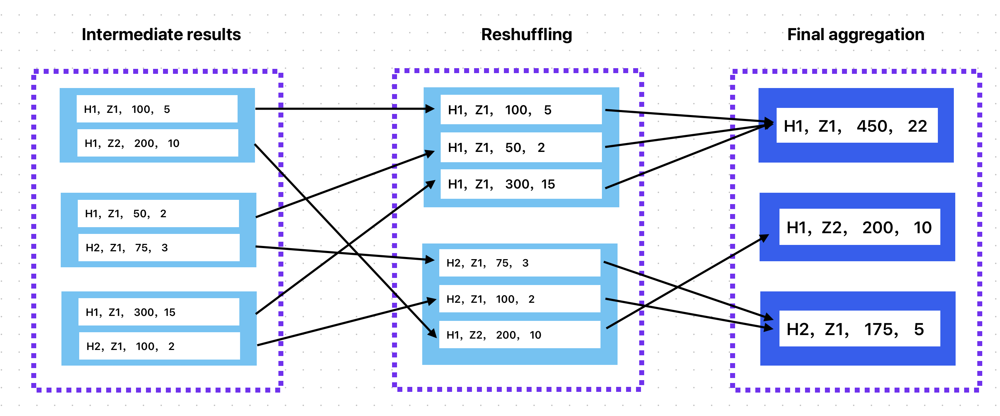

->Back : [Lesson 4: Analytics Engineering](4_analytics.md)
->Next : [Lesson 6: Streaming](6_streaming.md)

# Batch Processing

## Table of Contents
- [Batch Processing](#batch-processing)
  - [Table of Contents](#table-of-contents)
  - [Data Processing](#data-processing)
  - [Batch processing](#batch-processing-1)
  - [Streaming processing](#streaming-processing)
  - [Batch processing](#batch-processing-2)
- [Apache Spark](#apache-spark)
  - [Spark Architecture](#spark-architecture)
  - [Resilient Distributed Datasets (RDD)](#resilient-distributed-datasets-rdd)
  - [Directed Acyclic Graph (DAG)](#directed-acyclic-graph-dag)
  - [Spark Ecosystem](#spark-ecosystem)
  - [SparkSession](#sparksession)
  - [Spark DataFrames with CSV and Parquet](#spark-dataframes-with-csv-and-parquet)
  - [CSV](#csv)
  - [Parquet](#parquet)
  - [Partitions](#partitions)
  - [pySpark transformation and Action](#pyspark-transformation-and-action)
  - [Spark Features](#spark-features)
  - [Built-in](#built-in)
- [User-defined functions (UDFs)](#user-defined-functions-udfs)
- [Working with DataFrames and Spark SQL](#working-with-dataframes-and-spark-sql)
- [NY Taxis DataFrames](#ny-taxis-dataframes)
  - [GroupBy on Spark](#groupby-on-spark)
  - [Join in Spark](#join-in-spark)


## Data Processing

Data processing is the set of operations and techniques used to transform raw data into meaningful information. This information can be used to make decisions, perform analysis, and predictions, or automate processes. There are different techniques for processing data: batch and streaming (real-time) processes.

## Batch processing

Batch processing is used to periodically perform large, repetitive data jobs. Transformation, filtering, and sorting tasks can be computationally intensive and inefficient if executed on individual transactions. Instead, these tasks are processed in batches, often at off-peak times when compute resources are more available, such as at the end of the day or overnight.

Let's consider an online store that takes orders around the clock. Instead of processing each order as it happens, the system could collect all orders at the end of each day and share them in a block with the order fulfillment team.


## Streaming processing

Streaming processing is a method that is performed in real-time, as data is generated or received. When the amount of data is unknown or infinite, streaming processing is preferable to batch.

This approach is suitable for tasks that require a quick response, such as fraud detection, online system monitoring, sensor data (IoT) or log analysis.

Streaming data processing allows you to make quick decisions based on the latest information available.


## Batch processing

Batch processing handles datasets at set intervals. Banks, for instance, update accounts and transactions daily. This includes processing transactions, updating balances, calculating interest, and more. These tasks run during off-peak hours to ensure updated, accurate accounts for the next business day. This critical process helps banks maintain accurate records and meet regulatory requirements. Batch processes usually have intervals:

* Monthly (most common)
* Weekly (most common)
* Daily (most common)
* Hourly
* 3 per hour
* Every 5 minutes
* ...

Ocassionally, one can create a batch process in any programming language (e.g. Python, Java, Scala...), model the data with dbt and orchestrate the scripts with Apache Airflow, Prefect, Mage, DLT etc.


|Advantages |Disadvantages|
|-----------|---------|
|Very efficient for repetitive and large tasks. Instead of processing each data transaction individually, you work with large amounts at once. |Because batch processes are performed at specific time intervals, the data has a lag in becoming available.|
|It consumes fewer resources than real-time processing, resulting in lower infrastructure costs and compute capacity.| If an error occurs during batch processing, information may be lost and reprocessed.|
|Off-peak periods (weekends or evening hours) are used to process large amounts of data more quickly.| Batch processing can be complex to implement and maintain, especially when it comes to scheduling and ensuring the availability of adequate resources.|
|Facilitates scalability, if necessary more compute capacity can be provisioned (spark clusters)
|A batch job can be relaunched as many times as necessary.
|There are a multitude of tools and technologies on the market to facilitate the management of a batch mesh.
<p align='center'>Advantages and disadvantages of batch processing</p>

# Apache Spark

Apache Spark is an open-source data processing engine used to perform analysis and transformation of large volumes of data in clusters of distributed servers (parallelizing processing across different nodes). It was originally developed at the University of California, Berkeley, and is now maintained by the Apache Software Foundation. Basically, what Spark does is divide a workload into several portions that it distributes among different nodes or machines so that they work in parallel and when they finish, they group the results and return it.

Spark is known for its speed, as it can process large data sets much faster than other tools with the same goal, such as Hadoop MapReduce. Spark also supports multiple programming languages, such as Scala, Java, Python, and R. In addition, it provides a variety of libraries and tools for different data processing tasks, such as batching, streaming, graph processing, and machine learning (ML).

Within a Data Lake ecosystem, using Spark will help us in the process of data transformation. In a data lake, data is stored as files, usually csv or parquet, which we can query as if it were a SQL data model using tools such as Hive, Presto or Athena (in the Amazon AWS cloud), or BigQuery (in Google Cloud Platform). In the event that the logic is more complex and we can't solve it using SQL, Spark comes into play. In the same workflow we can combine both options, when the data can be transformed by SQL we will use this path, and when they are complex transformations we will do it with Spark.


## Spark Architecture

**Spark** is based on a distributed processing architecture, which means it uses a cluster or group of computers to process data. It consists of several components that communicate with each other to execute the tasks.

A Spark cluster consists of a **Driver process** that runs inside a **Master node** and **Executor processes** that run inside each of the **Worker nodes**. When a job is submitted to Spark, the Driver partitions and distributes the job in the form of tasks to Executor processes (on different Worker nodes) for further processing. As the application job runs, the Executor informs the Driver about the status of the task, and the Driver maintains the overall job status of the application. Each Worker has its own memory and CPU, and is connected to other Workers via a high-speed network. They can be added or removed from the cluster as needed to adjust processing capacity

How does the Driver process know which Executors are available for processing and to whom to distribute tasks? thanks to the **Cluster Manager**. Tracks the status of cluster resources (which Executor processes on which Worker nodes are available, and so on). The Driver is connected to the Cluster Manager via a SparkSession or a SparkContext (SparkSession would be above the SparkContext).
Spark has three main components:


The Apache Spark architecture consists mainly of two layers of abstraction:

## Resilient Distributed Datasets (RDD)

This is the cell of the Spark ecosystem, the building block for working with data. They are **immutable** (data cannot be changed once it is created), **distributed** (following the Spark pattern, they are partitioned between the nodes in the cluster), and **resilient** (it is automatically able to regenerate a partition that has been lost). There are two operations that can be performed on RDDs: transformations and actions.

## Directed Acyclic Graph (DAG)

The driver converts each task into a DAG (directed acyclic graph) job made up of vertices (RDD) and edges (their transformations). In colloquial language, each task is a job divided into stages (vertices) that follow a linear (acyclic) sequence. Stages are built with one of the Spark components (Core API, Spark SQL, Streaming, real-time processing, MLlIB, or GraphX).

## Spark Ecosystem

The Spark ecosystem is made up of the following elements:

* **Spark Core**: This is the core component of Spark and provides the basic functionalities, such as distributed processing, parallel programming, and fault tolerance. It's the API for batch processing.
* **Spark SQL**: Provides an API for working with structured or semi-structured data using SQL. It offers us three ways to do this:
  * **DataFrames**: A distributed data structure that is organized into columns with names and data types (similar to a relational table). They can be created from structured data files such as CSV or JSON, or by reading data from a relational database using Spark SQL. DataFrames can also be transformed using filtering, aggregation, and joining operations to perform data analysis tasks.
  * **Datasets**: This is a more secure and heavily typed API that sits on top of DataFrames. Datasets make it easier and more natural to work with structured data, as you define the schemas of the data statically. They are generated from CSV files, JSON, relational databases, etc. They can also be transformed using filtering, aggregation, and union operations.
  * **SQL** language through a SQL API to work on DataFrames and Datasets. It supports a wide range of SQL functions such as SELECT, FROM, WHERE, JOIN, GROUP BY, ORDER BY, etc.
* **Spark Streaming**: This is a component that allows you to process data in real time, such as Twitter or Facebook posts. It processes the data in batches and uses the same API as Spark Core.
* **Spark MLlib**: Provides machine learning algorithms to perform tasks such as classification, regression, and data grouping in distributed mode.
* **Spark GraphX**: Provides tools for working with graph data and performing network and graph analysis.

PySpark (Python + Apache Spark)
PySpark is a Python library for developing applications that exploit all the capabilities of Apache Spark (distributed processing parallelizing workloads between nodes), ideal for large-scale data and machine learning (ML) projects. We need to download the library either by or by following the instructions in the bootcamp.

## SparkSession

**SparkSession** is a class in PySpark that is used to work with Spark and provides a single interface for interacting with different types of data in Spark, such as RDD, DataFrames, and DataSet. **SparkSession** is used to create and configure SparkContext, SQLContext, and HiveContext in a single session.

To instantiate a **SparkSession** we must invoke the constructor and pass several parameters to it. We are going to work with only the first two:

* `appName`: Name of the Spark application, e.g. "test«
* `master`: Specifies the address of the Spark cluster in which the application will run. This can be a URL from a standalone Spark cluster or local execution:
  * `local`: Specifies the local execution mode, that is, it will run on a single machine as a local process.
  * `local[N]`: Specifies the local execution mode with N threads.
local[*]: Specifies the local execution mode with as many threads as there are available CPU cores.
  * `yarn`: Specifies the mode of execution in a YARN cluster.
  * `mesos`: Specifies the mode of execution in a Meso cluster.
  * `spark://HOST:PORT:` Specifies the URL of a separate Spark cluster.
  * `k8s://https://HOST:PORT`: Specifies the URL of the Kubernetes API server on which the application will run.
* config: Additional Spark configurations.
  * `spark.executor.memory`: Amount of memory allocated to each executor.
  * `spark.driver.memory`: Amount of memory allocated to the driver.
  * `spark.sql.shuffle.partitions`: Number of partitions used by shuffle operations in SQL.
  * `spark.serializer`: Serializer used to serialize/deserialize objects.
* `spark.ui.port`: Port used by the Spark web UI.

 ```python
 from pyspark.sql import SparkSession

 spark = SparkSession.builder \
        .appName("test") \
        .master('local[*]')
        .getOrCreate()
```

To access the Spark UI we can consult the URL <http://localhost:4040> (if we have not specified another port in the configuration). If you want to create another SparkSession for another notebook, you can specify a new port other than the default 4040 in the :`.config()`

```python
from pyspark.sql import SparkSession

spark = SparkSession.builder \
    .master("local[*]") \
    .appName('test') \
    .config("spark.ui.port", "4041") \
    .getOrCreate()
```

## Spark DataFrames with CSV and Parquet

As mentioned above, a DataFrame is a set of data that is typed and organized into columns. Next, we're going to see how to load the content of a CSV or a Parquet into a **PySpark** DataFrame. As a brief brushstroke of the Parquet format, it is a file type widely used in the world of data as it has a high degree of compression (1:10 compared to CSV) thanks to the fact that it stores the data in a columnar way, not by rows, which allows you to adjust the typing and therefore the necessary space. Another advantage is that the schema of the data is included in the file itself, so it is not necessary to infer or assign it.

## CSV

We can specify some configuration parameters, for example it indicates that the first row is the header and it will infer schema based on the data in each column.

```python
df = spark.read.csv('taxi+_zone_lookup.csv', header=True, inferSchema=True)
```

## Parquet

The advantage of uploading a Parquet file instead of another format is that these files typically have a smaller size and higher processing efficiency due to their columnar structure and data compression.read.parquet()

```python
df = spark.read.parquet('taxi+_zone_lookup.parquet')
```

## Partitions

In PySpark, partitions are used to divide a dataset into smaller chunks and distribute them across a Spark cluster. Each partition is processed in parallel by an executor in the cluster, allowing large data sets to be processed more efficiently and scalably. For example, if we want to process a 1GB CSV or parquet file, we could segment it into 10 partitions so that each one is worked in parallel on 10 nodes in the cluster.

Partitions are one of the fundamental units of processing in Spark and are used in various types of data objects, such as RDDs, DataFrames, and DataSets. In general, it is recommended to have an adequate number of partitions for a given dataset, as too many partitions can lead to excessive overhead in communication between executors, and too few partitions can result in inefficient utilization of cluster resources.

Partitions can be specified when creating an RDD or when reading a dataset into a DataFrame or DataSet. For example, when reading a CSV file in a DataFrame, you can specify the number of partitions using the parameter:`numPartitions`

```python
df = spark.read.csv("path")\
          ,header=True,\
          ,inferSchema=True)\
          ,numPartitions=8)
```

It is also possible to adjust the number of partitions in an existing RDD or DataFrame using the `repartition` method. The method will randomly redistribute the data across the cluster and create the specified number of partitions, while merging adjacent partitions to create the specified number of partitions.

```python
df = df.repartition(24)  # Reduce the number of partitions to 24
```

If we want to persist the DataFrame in a parquet file, for example, we will use the method by passing the directory for the output as a parameter: `write.parquet`

```python
df = df.repartition(24)
df.write.parquet('fhvhv/2021/01/')
```

If we check the Spark UI (<http://localhost:4040>) the progress of the work we can see that it is divided into two stages: firstly Spark creates as many partitions as cores our CPU has (remember that we have created the SparkSession with (*)), so if we have 4, it will divide the DataFrame into 4 partitions. Each partition generates a task. When the 4 tasks of this stage have been completed, the partitioning that we have specified is generated. In the example, 10 tasks will be generated, each for each partition. As our CPU only has 4 cores, the tasks will be queued and executed as they become available. Each of the partitions is stored in a file with the suffix, which is parquet's default high-speed compression format. `Local[*]_snappy.parquet`

## pySpark transformation and Action

In PySpark, operations are divided into two categories: **Transformations** and **Actions***

**Transformations** are operations that take a DataFrame as input, apply a transformation, and generate a new DataFrame as a result. They are "lazy" operations, which means that they are not executed immediately but are stored in the transformation network until an action is required.

* **select()** - Select specific columns.
* **filter()** - Filters rows that satisfy a specific condition.
* **groupBy()** —Group rows by one or more columns.
* **join()** - Joins two DataFrames based on one or more common columns.
* **distinct()** - Returns a new DataFrame that contains only distinct values.
* **orderBy()** —Sorts rows based on one or more columns.
* **withColumn()** - Add a new column or replace an existing column with a new one.
* **drop()** - Deletes one or more columns.

**Actions**, on the other hand, are operations that take a DataFrame as input and produce a result that is stored or displayed. Actions are operations that "activate" the transformation network and cause stored transformations to run.

* **show()**: Displays a preview of a set number of rows.
* **count()**: Counts the number of rows.
* **collect()**: Collects all the data in the driver's memory.
* **write()**: Writes to an external file or data source.
* **first()**: Returns the first row.
* **max()**: Returns the maximum or minimum value in a numeric column.min()
* **sum()**: Returns the sum of the values in a numeric column.
* **mean()**: Returns the average of the values in a numeric column.
* **pivot()**: Creates a pivot table from there.

In general, it is recommended to minimize the number of actions in PySpark and maximize the use of transformations, as these are more efficient and allow for better optimization of the data processing flow.

## Spark Features

Within the Spark ecosystem we can find two types of functions: a group of built-in functions included by default to perform different operations and User-defined functions (UDF) which are custom functions that we can develop to our liking.

## Built-in

functions Here's how to import them. To see all the available options, simply type in a cell in a notebook F. and press Tab.

```python
from pyspark.sql import functions as F
```

Following the example of the course, we can convert an to using the function :DATETIMEDATEto_date()

```python
df \
    .withColumn('pickup_date', F.to_date(df.pickup_datetime)) \
    .withColumn('dropoff_date', F.to_date(df.dropoff_datetime)) \
    .select('pickup_date', 'dropoff_date', 'PULocationID', 'DOLocationID') \
    .show()
```

# User-defined functions (UDFs)

A User-Defined Function (UDF) in Spark is a user-defined function that can be used to perform custom data transformations in a DataFrame or RDD. UDFs are defined in Python, Java, Scala, or R, and can be applied in PySpark, Spark SQL, and Spark Streaming. To define a UDF in PySpark, we can use the library function. Below is an example of how to define a UDF in PySpark to calculate the square of a number: `udf()pyspark.sql.functions`

```python
from pyspark.sql import functions as F
from pyspark.sql.types import DoubleType

def exponent(x,n):
    return x**n

exponent_udf = F.udf(exponent, DoubleType())
```

In this example, you define a function that calculates a number x raised to the power n, and then use the function F to convert it to a UDF. The UDF is defined to take an input argument of type double , interger and return a value of type double.square()udf()

Once a UDF has been defined, it can be applied to a column in a DataFrame using the PySpark function:withColumn()

```python
df \
    .withColumn('square_trip_miles', exponent_udf(df.trip_miles)) \
    .select("hvfhs_license_num","trip_miles","square_trip_miles") \
    .show(10)
```

# Working with DataFrames and Spark SQL

We can work with a DataFrame using PySpark methods or take advantage of one of Spark's key components: SQL API. Thanks to which we can query DataFrames as if they were relational tables and launch queries in standard SQL. Let's take a look at two examples of the same use case. We're going to load a parquet file with online sales data. The file has three columns : product, price, date, quantity.

To exploit a DataFrame with PySpark we open our DataFrame with PySpark.

```python
from pyspark.sql import SparkSession

spark = SparkSession.\
        builder.\
        appName("albert_de_148").\
        getOrCreate()

df = spark.read.parquet("dellor/vendors.parquet")

date = "2022-02-28"
df_product_sales= df.filter(df.date == date).\
                  groupBy("product").\
                  sum("price")

df_product_sales.show()
```

By using the Spark SQL API, we will be able to write standard SQL and query the DataFrame as though it were a relational table using the `spark.sql` API. However, it is necessary to create a temporary table from the DataFrame using the function and passing the name of the table as a parameter, in our case `.spark.sql()`, `createOrReplaceTempView()`, `inventory`.

```python
from pyspark.sql import SparkSession

spark = SparkSession.\
        builder.\
        appName("albert_de_148").\
        getOrCreate()

df = spark.read.parquet("dellor/inventory.parquet")

df.createOrReplaceTempView("inventory")

date = "2022-02-28"
product_inventory = spark.sql(f"SELECT product, SUM(quantity) FROM inventory  WHERE date = '{date}' GROUP BY producto")

product_inventory.show()
```

# NY Taxis DataFrames

In the bootcamp examples, we're going to use data from the 2020 and 2021 NY green and yellow taxi races. We can download them manually, from a Jupyter notebook and with the shell script that they have prepared in the course (download_data.sh) and launching the commands:

```shell
bash download_data.sh yellow 2020
bash download_data.sh yellow 2021
bash download_data.sh green 2020
bash download_data.sh green 2021
```

1. We are going to generate a DataFrame grouping all the monthly files for each type of taxi (green and yellow).

```python
df_green  = spark.read.csv('data/raw/green/*/*', header=True, inferSchema=True)
df_yellow = spark.read.csv('data/raw/yellow/*/*',header=True, inferSchema=True)
```

2. As the goal is to unite them into a single DataFrame, we must make sure that they have the same scheme. We are going to perform several actions to create the new dataframe with the columns that both have in common and also add a new one that identifies the origin: `df_yellow.schema()`, `df_green.schema()`

* Add a new column in each df to identify the source using the transform operator and the Spark built-in library function that allows us to specify a literal value:

`.withColumn(columna name, value)`,

`F.lit()`,

`.withColumn('service_type', F.lit('green'))`

* Columns that are not in both DataFrames. The quick way is to convert the list of columns to python and combine them, but we lose the order of the columns, so we have to use a loop to go through comparing both lists and generating a new one with the ones they have in common using `SET FOR`
* Columns with the dates of ascent and descent ( and ) have different names. Let's rename them in both df with the transform operator.

`xy_pickup_datetime`,

`xy_dropoff_datetime`,

`.withColumnRenamed(column name, column value)`

```python
from pyspark.sql import functions as F

# rename data column:

df_green = df_green \
    .withColumnRenamed('lpep_pickup_datetime', 'pickup_datetime') \
    .withColumnRenamed('lpep_dropoff_datetime', 'dropoff_datetime')

df_yellow = df_yellow \
    .withColumnRenamed('tpep_pickup_datetime', 'pickup_datetime') \
    .withColumnRenamed('tpep_dropoff_datetime', 'dropoff_datetime')

# generate a list with columns in common between both DataFrames

common_colums = []

yellow_columns = set(df_yellow.columns)

for col in df_green.columns:
    if col in yellow_columns:
        common_colums.append(col)

# We generate the new DFs for each type with only the columns in common and adding the service_type to identify the type of taxi:

df_green_sel = df_green \
    .select(common_colums) \
    .withColumn('service_type', F.lit('green'))

df_yellow_sel = df_yellow \
    .select(common_colums) \
    .withColumn('service_type', F.lit('yellow'))
```

3. Finally, we are going to combine both DataFrames, which now have the same schema and a new column to identify the type of taxi.

```python
df_trips_data = df_green_sel.unionAll(df_yellow_sel)
```

We can check the number of registrations by type of taxi using PySpark:

```python
df_trips_data.groupBy('service_type').count().show()
```

NB: put dag here tp explain the steps.

## GroupBy on Spark

Let's take a look at how Spark manages the operator GroupBy internally. We can try Spark SQL or PySpark. For our example, let's calculate the profit and number of trips per hour and area of taxis.

If we want to calculate it with PySpark:

```python
import pyspark
from pyspark.sql import SparkSession
from pyspark.sql import functions as F

spark = SparkSession.builder \
    .master("local[*]") \
    .appName('test_groupby') \
    .config("spark.ui.port", "4042") \
    .getOrCreate()

df_green = spark.read.csv('data/raw/green/*/*', header=True, inferSchema=True)

df_green_revenue = df_green.filter("lpep_pickup_datetime >= '2020-01-01 00:00:00'") \
    .withColumn("hour", F.date_trunc("hour", "lpep_pickup_datetime")) \
    .groupBy("hour", "PULocationID") \
    .agg({"total_amount": "sum", "*": "count"}) \
    .withColumnRenamed("sum(total_amount)", "amount") \
    .withColumnRenamed("count(1)", "number_records") \
    .orderBy("hour","PULocationID")
```

or with Sparksql

```python
import pyspark
from pyspark.sql import SparkSession

spark = SparkSession.builder \
    .master("local[*]") \
    .appName('test_groupby') \
    .config("spark.ui.port", "4042") \
    .getOrCreate()

df_green = spark.read.csv('data/raw/green/*/*', header=True, inferSchema=True)

df_green.createOrReplaceTempView("green")

df_green_revenue = spark.sql("""
SELECT 
    date_trunc('hour', lpep_pickup_datetime) AS hour, 
    PULocationID AS zone,

    SUM(total_amount) AS amount,
    COUNT(1) AS number_records
FROM
    green
WHERE
    lpep_pickup_datetime >= '2020-01-01 00:00:00'
GROUP BY
    1, 2  
""")

df_green_revenue.show()
```

NB： show df_green_ revenue

Let's persist the output on a parquet floor and analyze how it performs the Spark task:

```python
df_green_revenue.write.parquet('data/report/revenue/green', mode="overwrite")
```

As it is distributed processing, the data is divided into partitions that are sent to each of the executors. To combine the results of each, the shuffle operation is performed.

If we look at the Spark UI, we see that the task has been divided into two stages, the first to prepare the groupBy (generates the intermediate groupings of each executor) and the second generates the final result by combining them (shuffle). Spark has not only generated two stages for the task, but has also executed each stage in a separate job. The reason is that the shuffle operation is very expensive. To speed up the processing, the first job stores the intermediate results in the cache that will then be used by the shuffle, so in the second job the first stage appears as Skipped, which has already been processed in the first one. [spark shuffle documentation](https://spark.apache.org/docs/1.5.0/programming-guide.html#performance-impact).

If we analyze each of the stages in detail, in the first one the data is divided into partitions and each one is sent to an executor, where the necessary groupings and operations (filter and groupBy) are carried out. This generates the groupings or *intermediate results*, where H is the hour, Z the zone and the two KPIs with the profit and total of runs.


In the second stage, *the shuffle* operation is performed to combine all the intermediate results and group the data with the same key in the same partition. Spark identifies the columns of the (in our example and ) as key. Finally, a new one is performed on the new partitions to reduce the data by grouping it by the key. It is possible that some of the partitions generated by the shuffle operation contain data from different keys, but in the last grouping operation it is spread across the corresponding partitions.`GroupBy hour zone`, `GroupBy`



## Join in Spark

In Spark we can combine two DataFrames as if they were two relational tables using: `.join(df, on, how)`

1. `df`: The DataFrame that will be joined to the parent DataFrame. It must be specified as a Pyspark DataFrame object.
2. `on`: One or more columns common to both tables that will be used to join the df. It can be specified as a string that contains the name of the column, or a list of strings that contain the names of the columns ().`["id","nombre"]`
3. `how`: The type of join to be made. You can take one of the following values:

* `'inner'`: Performs an inner join, that is, returns only records that are matched in both tables.
* `'outer'` or : Performs a full outer join, that is, returns all records in both tables, even if they don't have a match in the other table.`'full'`
* `'left'` or : Performs a left outer join, that is, returns all records in the left DataFrame and matching records in the right DataFrame. If there are no matches in the right DataFrame, the values for the columns in the right DataFrame will be .`'left_outer'null`
* `'right'` or : Performs a right outer join, that is, returns all records in the right DataFrame and matching records in the left DataFrame. If there are no matches in the left DataFrame, the values for the columns in the left DataFrame will be .`'right_outer'null`
* `'left_semi'`: Performs a left semijoin join, that is, returns only records in the left DataFrame that are matched in the right DataFrame.
* `'left_anti'`: Performs an anti-left join, that is, returns only records in the left DataFrame that do not have a match in the right DataFrame.

  ```python
  from pyspark.sql.functions import *

df = df1.join(df2, on='id', how='left')
```

->Back : [Lesson 4: Analytics Engineering](4_analytics.md)
->Next : [Lesson 6: Streaming](6_streaming.md)